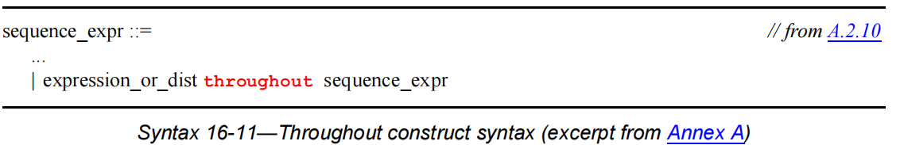

- [断言](#断言)
  - [16.3. 立即(Immediate)断言](#163-立即immediate断言)
  - [16.5. 并发(Concurrent)断言概述](#165-并发concurrent断言概述)
    - [16.5.1 采样](#1651-采样)
  - [16.7 序列](#167-序列)
  - [16.8 序列(Sequence)声明](#168-序列sequence声明)
      - [16.8.1 序列声明中的 *typed* 形参](#1681-序列声明中的-typed-形参)
      - [16.8.2 序列声明中的局部变量形参](#1682-序列声明中的局部变量形参)
  - [16.9 序列操作符](#169-序列操作符)
    - [16.9.1 操作符展示](#1691-操作符展示)
    - [16.9.2 序列的重复(repetition)](#1692-序列的重复repetition)
    - [16.9.3 采样函数](#1693-采样函数)
    - [16.9.5 and 操作符](#1695-and-操作符)
    - [16.9.6 intersect (带长度限制的 and)](#1696-intersect-带长度限制的-and)
    - [16.9.7 or 操作符](#1697-or-操作符)
    - [16.9.8 first\_match() 操作符](#1698-first_match-操作符)
    - [16.9.9 Conditions over sequences](#1699-conditions-over-sequences)
    - [16.9.10 sequence contained within another sequence](#16910-sequence-contained-within-another-sequence)
    - [16.9.11 使用简单序列构成复杂序列](#16911-使用简单序列构成复杂序列)
  - [16.10 序列的局部变量](#1610-序列的局部变量)
  - [16.11 在序列的 match 中调用 subroutine](#1611-在序列的-match-中调用-subroutine)
  - [16.12 属性的声明](#1612-属性的声明)
    - [16.12.1 属性的实例化](#16121-属性的实例化)
    - [16.12.2 序列属性(sequence property)](#16122-序列属性sequence-property)
    - [16.12.3 否定属性(negation property)](#16123-否定属性negation-property)
    - [16.12.4 或属性(disjunction property)](#16124-或属性disjunction-property)
    - [16.12.5 和属性(conjunction property)](#16125-和属性conjunction-property)
    - [16.12.6 if-else 属性](#16126-if-else-属性)
    - [16.12.7 Implication](#16127-implication)
    - [16.12.8 implyes 和 iff 属性](#16128-implyes-和-iff-属性)
    - [16.12.9 followed-by 属性](#16129-followed-by-属性)
    - [16.12.10 nexttime 属性](#161210-nexttime-属性)
    - [16.12.11 always 属性](#161211-always-属性)
    - [16.12.12  until 属性](#161212--until-属性)
    - [16.12.13 eventually 属性](#161213-eventually-属性)
    - [16.12.14 abort 属性](#161214-abort-属性)
    - [16.12.15  weak 和 strong 操作符](#161215--weak-和-strong-操作符)
    - [16.12.16 case](#161216-case)
    - [16.12.17 递归属性](#161217-递归属性)
    - [16.12.18 属性声明中的有类型形参](#161218-属性声明中的有类型形参)
    - [16.12.19 属性声明中的局部变量形参](#161219-属性声明中的局部变量形参)
    - [16.12.20 属性的例子](#161220-属性的例子)
    - [16.12.21 有限长度 vs 无限长度](#161221-有限长度-vs-无限长度)
    - [16.12.22 非退化的(nondegeneracy)](#161222-非退化的nondegeneracy)
  - [16.13 多时钟支持](#1613-多时钟支持)
  - [16.14 并发断言](#1614-并发断言)
    - [16.14.1 断言(assert)语句](#16141-断言assert语句)
    - [16.14.2 assume 语句](#16142-assume-语句)
    - [16.14.3 覆盖(cover)语句](#16143-覆盖cover语句)
    - [16.14.4 restrict 语句](#16144-restrict-语句)
    - [16.14.5 在过程代码外使用并发断言](#16145-在过程代码外使用并发断言)
    - [16.14.6 在过程块代码中嵌入并发断言](#16146-在过程块代码中嵌入并发断言)
      - [16.14.6.1 过程并发断言的参数](#161461-过程并发断言的参数)
      - [16.14.6.2 procedual assertion flush points](#161462-procedual-assertion-flush-points)
      - [16.14.6.3 过程并发断言和毛刺(glitch)](#161463-过程并发断言和毛刺glitch)
      - [16.14.6.4 禁止并发断言(disabling procedual concurrent assertions)](#161464-禁止并发断言disabling-procedual-concurrent-assertions)
    - [16.14.7 用于推断值的函数(inferred value functions)](#16147-用于推断值的函数inferred-value-functions)
    - [16.14.8 非空计算(nonvacuous evaluation)](#16148-非空计算nonvacuous-evaluation)
  - [16.15 disable iff 解析 (Disable iff resolution)](#1615-disable-iff-解析-disable-iff-resolution)
  - [16.16 时钟解析( clock resolution)](#1616-时钟解析-clock-resolution)
    - [16.16.1 多时钟驱动的序列和属性的 semantic leading clock](#16161-多时钟驱动的序列和属性的-semantic-leading-clock)
  - [16.17 Expect 语句](#1617-expect-语句)
  - [16.18 时钟块和并发断言](#1618-时钟块和并发断言)


# 断言  
  - assert, 指定设计所需遵守的属性, 验证属性是否成立.  
  - assume, 指定环境的属性. 激励发生器(stimulator)检查属性是否成立,而且形式化工具(formal tool)可以使用其产生对应的激励.  
  - cover, 为覆盖率(coverage)统计监控对应的属性.  
  - restrict, 指定一些属性, 作为形式化验证计算时的约束. 激励发生器不检查此属性.  
  有两种不同的断言: 立即断言和并发断言
  1. 立即断言的执行符合仿真事件(simulation event)的语义, 其执行如同过程块(procedural block)中的普通语句一样. 不存在立即 restrict 断言语句.
  2. 立即断言基于时钟语义(clock semantics), 其会采样表达式的值.  
   
  注意, 后续的描述不仅仅用于仿真, 同时用于形式化验证, 此会出现类似于"当前时刻, 未来时刻, 无穷, 有限"等描述,请注意区分是用于仿真还是形式化.  
## 16.3. 立即(Immediate)断言
  立即断言用于测试一条表达式是否成立. 表达式的行为类似于过程性块中的 if 语句. 如果表达式的值为 x,z, 0 则此断言表达式为 fail, 否则为 pass/success.  
  有两种立即断言 -- 简单立即断言(simple immediate assertions) 和 受抑制的立即断言(deferred immediate asertions). 对于 simple 立即断言, 在assert(statement)中的statement计算完毕后立即产生 pass 或者 fail. 而对于 deferred 立即断言, pass 或 fail 会推迟到当前 time step 之后, 以此避免毛刺信号对断言的干扰.  
  过程性语句可以出现的地方就可以出现立即断言语句.  
  可以通过断言控制系统函数控制立即断言的执行.  
  立即断言可以是 assert, assume, 和 cover.  
  如果立即 assert fail 了且未指定 else 语句, 则仿真(或者其他)工具下载默认情况下需要调用$error, 除非使用 $assertcontrol 系统函数 (control_type = 9, FailOff) 抑制此行为.  
  立即 assume 可以用于形式化验证工具以指定设计的输入端口的预期值, 以此约束验证工具. 当以此类方式使用的时, assume 作用于设计的环境, 而不是设计本身. 在仿真中, 立即 assume 可以如立即assert一样验证环境的行为.  

  ```verilog  
    // 立即断言举例
    initial begin 
        wait(rst);
        @(posedge clk);
        assert (a == 1) begin 
            $display(" assert (a == 1) passed");
        end 
        else begin 
            $display("assert (a == 1) failed");
        end
        assert (b == 0);
    end
  ```
  立即 cover 语句将其表达式的成功次数作为覆盖率目标(coverage goal). 立即 cover 语句的覆盖率结果会包含此语句执行过的次数, 执行成功的次数.  
  立即 cover 后面不可以加 else, 此点不同于 assert 和 assume.  

  ```verilog  
    initial begin 
        wait(rst);
        @(posedge clk);
        cover (a == 1)begin:cov
            $display("cover (a == 1) : %m");
        end
    end

    可以使用以下系统函数打印断言的信息:  
    - $fatal()  
    - $error()  
    - $warning()
    - $info()
  ```
  

## 16.5. 并发(Concurrent)断言概述

  并发断言描述的行为贯穿整个仿真时间. 不同于立即断言, 并发断言的计算模型基于时钟, 其只会在每个时钟 tick 发生的时刻计算表达式的值. 并发断言所使用的时钟应当是无毛刺的, 在每个 time step 应当只会变化一次. 如果时钟在相同 time step 变化多次, 则并发断言的结果是未定义的.  
  并发断言在仿真的 Observed region 计算表达式的值.  

### 16.5.1 采样

  并发断言对于表达式中变量值的采样通常在 preponed region, 不过也有着许多的特殊情况, 以下为采样的规范定义.
  采样到的表达式的值基于表达式中的变量被采样到的值, 变量的采样规则如下:  
  
  - 对于大于 0 的时刻, 变量值在当前时刻的 preponed region 采样.  
  - 对于 0 时刻, 变量采样到的值为变量类型的默认值.  
  
  |type/function|default value|  
  |--|--| 
  |4-state          |integral 'X |
  |2-state          |integral '0 |
  |real, shortreal  |0.0 |
  |Enumeration      |Base type default initial value |
  |string           |"" (empty string)|
  |event            |New event|
  |class            |null |
  |interface class  |null |
  |chandle          |(Opaque handle) null|
  |virtual interface|null|
  |event.triggered()|false(0)|
  |sequence_instance.matched|false(0)|  

  上述规则的例外情况:  
  - automatic 变量, 局部变量, active free checker variable 采样值为当前值而非 preponed region 的值, 例外的例外:  
    - 如果某个采样值引用了 active free checker varable 的过去或未来的值, 则在相应时钟的过去或未来 tick 的 postponed region采样.
    - 如果某个值引用了 automatic 变量的过去或者未来的值,则使用当前的值替代.  
  - 如果某个变量是一个时钟块的输入变量, 则此变量需要使用此时钟块采样(且 input #1step), 否则导致错误.  

## 16.7 序列  

语法:  

.png)  

.png)  

.png)  


## 16.8 序列(Sequence)声明  

可以在以下地方声明一个命名 sequence.  
- module 
- interface 
- program 
- clocking block 
- package 
- compilation-unit scope 
- checker 
- generate block  

序列声明的语法:  

  

命名序列可以在声明时在可选的 *sequence_port_list* 中指定形参.  

可以在 *formal_port_identifier* 之前为形参指定类型. 在未到达下一个参数类型之前, 参数的类型应当作用于其之后的所有形参标识符. 关于形参的使用规则 see 16.8.1.  

关于局部变量形参的使用规则 see 16.8.2.  

如果一个形参标识符未被指定类型, 则成为 *untyped* 形参, 形参不存在默认参数.  

序列形参所支持的数据类型就是关键词 **untyped** 和断言表达式所支持的操作数类型(see 16.6).  

可以为形参指定默认值. *default_expression* 将在对应的序列声明所在的 scope 进行解析.  

对于一个 *typed* 形参, 其对默认参数的类型要求 see 16.8.1.  

对于一个 *untyped* 形参, 只要按照 F.4.1(see F.4.1) 的重写算法后能生成合法的序列, 则其默认参数可以为任意类型.  

可以在命名序列声明中引用形参. 对形参的引用可以代替许多语法实体, 如:  

- identifier
- expression
- sequence_expr
- event_expression
- 用于 *cycle_delay_const_range_expression* 语法的 \$  

可以通过引用命名序列的名字以实例化序列. 可以使用层次引用(see 23.6). 可以在 *seuqnce_expr* 可以出现的地方使用实例化一个命名序列. 命名序列也可以作为 *sequence_method_call* 的一部分(see 16.9.11, 16.13.5)或作为事件表达式引用(see 9.4.2.4). 如果因为序列之间的实例化导致了循环依赖, 产生 error. 序列间的循环依赖是指在有向图上有一个环, 环的节点为命名序列(如果一个序列在声明体中实例化了另外一个序列则会产生一个边, 或者形参的默认参数为另外一个序列会产生一个边, 或者在序列实例化的时候为其指定的实参为另外一个序列也会产生一个边).  

在实例化命名序列的时候需要为所有没有默认值的形参分配对应的实参. 有默认参数的形参也可以分配对应的实参以覆盖默认值. 可以通过名字绑定或者位置绑定的方式分配实参.  

符号 \$ 可以作为命名序列实例的实参. 如果 \$ 为实参, 则其所对应的形参应当为 *untyped*.  

如果在局部变量(see 16.10)的 scope 内实例化一个命名序列, 则可以引用局部变量作为实参.  

命名序列的实例的序列行为和匹配语义等同于通过 F.4.1 中提到的重写算法展平后的序列. 重写算法使用实参替换命名序列声明中的相应形参. 重写算法本身并不负责名字的解析, 而是假设在重写算法开始之前名字便解析完毕了. 如果展开后的序列为 illegal, 则对于的实例也 illegal 且产生 error.  

对于 *untyped* 的形参, 重写算法在使用实参替换形参的时候会使用表达式形式进行替换. 在替换形参之前, 需要使用括号将实参保卫, 实参应当转换为由其本身决定的类型, 不过下面两种情况下除外:  

- 实参是 \$  
- 实参是 *variable_lvalue*  

例如, 当实参为 elaboration-time constant 时, 其对应的无类型形参可以出现在 *cycle_delay_range*, *boolean_abbrev*, 或 *sequence_abbrev* 中. 下面的例子展示了形参的此类用法:  

```verilog  
sequence delay_example(x, y, min, max, delay1);  
  x ##delay1 y[*min:max];  
endsequence  

// Legal  
a1: assert property (@(posedge clk) delay_examp(x, y, 3,  $, 2));

int z, d
// Illegal: z 和 d 不是 elaboration-time constant
a2_illegal: assert property (@(posedge clkdelay_example   (x, y, z, $, d));
```  

在下面的例子中, 命名序列 s1 和 s2 在连续的 clk **posedge** 事件驱动下 evaluate. s3 在连续的 clk **negedge** 事件驱动下 evaluate. 命名序列 s4 在连续的 clk **posedge** 和 **negedge** 事件驱动下 evaluate.  

```verilog
sequence s1;
  @(posedge clk) a ##1 b ##1 c;
endsequence

sequence s2;
  @(posedge clk) d ##1 e ##1 f;
endsequence

sequence s3;
  @(negedge clk) g ##1 h ##1 i;
endsequence

sequence s4;
  @(edge clk) j ##1 k ##1 l;
endsequence
```  

下面是一个有参数的命名序列声明:  

```verilog  
sequence s20_1(data,en);
  (!frame && (data==data_bus)) ##1 (c_be[0:3] == en);
endsequence
```  

此例子中的 sequence 并未指定时钟, 因此时钟继承于某个外部源, 比如 sequence, property 或 assert 语句.  

```verilog  
    sequence s;
        a ##1 b ##1 c;
    endsequence
    
    sequence rule;
    @(posedge sysclk)
        trans ##1 start_trans ##1 s ##1 end_trans;
    endsequence
```  

命名序列 rule 等价于:  

```verilog
sequence rule;
  @(posedge sysclk) 
  trans ##1 start_trans ##1 (a ##1 b ##1 c) ##1 end_trans ;
endsequence
```  

下面的例子展示了 s1 和 s2 之间不合法的循环依赖关系:  

```verilog
sequence s1;
  @(posedge sysclk) (x ##1 s2);
endsequence

sequence s2;
  @(posedge sysclk) (y ##1 s1);
endsequence
```  

#### 16.8.1 序列声明中的 *typed* 形参  

#### 16.8.2 序列声明中的局部变量形参  

## 16.9 序列操作符

### 16.9.1 操作符展示  

|SystemVerilog expression operators | Associativity |
|-|-|
|[* ] [= ] [-> ] |-|
|##         | Left  |
|throughout | Right |
|within     | Left  |
|intersect  | Left  |
|and        | Left  |
|or         | Left  

### 16.9.2 序列的重复(repetition)  

repetition 与 delay 的区别, 在"[]"内的东西基本上一样, 但是 repetition 是没有 "##" 符号的.  

|符号|含义|等价|
|-|-|-|
|X[*a:b]|X 在连续的周时钟期成立 a 到 b 次|-|
|X[*a]|X 在连续的时钟周期成立 a 次|-|
|X[*]|相当于 X[*0:$]|X[*0:$]|
|X[+]|相当于 X[*1:$]|X[*1:$]|
|X[=a:b]|X 在非连续的时钟周期成立 a 到 b 次, 结束后不应当继续成立|X[->a:b] ##1 !X[*0:$] ##0 |
|X[=a]|X 在非连续的时钟周期内成立 a 次, 结束后不应当继续成立|X[->a] ##1 !X[*0:$]|
|X[->a:b]|在非连续的周期内 X 成立 a 到 b 次|(!X[*0:$] ##1 X)[*a:b]|
|X[->a]|在非连续的周期内 X 成立 a 次| (!X[*0:$] ##1 X)[*a]|

b >= a, b 也可以是 $ .  

### 16.9.3 采样函数  

```verilog  
$sampled ( expression )
$rose ( expression [, [clocking_event] ] )
$fell ( expression [, [clocking_event] ] )
$stable ( expression [, [clocking_event] ] )
$changed ( expression [ , [ clocking_event ] ] )
$past ( expression1 [, [number_of_ticks ] [, [expression2 ] [, [clocking_event]]] ] )
````  

如果能从上文推断出时钟, 则不需要显式指定 clocking_event.  
对于并发断言, 在断言表达式中的 $sampled(a) 和直接使用 a 没有区别, 但是对于并发断言的动作块中的代码来说, 结果可能不同.  

```verilog
logic a, b, clk;
// ...
a1_bad: assert property (@clk a == b)
else $error("Different values: a = %b, b = %b", a, b);
a2_ok: assert property (@clk a == b)
else $error("Different values: a = %b, b = %b",
$sampled(a), $sampled(b));
```  

假设 @(clk a == b) 中采样到的 a = 1, b = 0, 但是对于 a1_bad, $error()可能采样到 a = 0, b = 0.  

\$past() 中的 expression1 为待采样表达式, expression2 为 clocking_event 的门控表达式, 也就是说 number_of_tiscks 是指 expression2 && clocking_event 发生了几次.  
$past() 会返回 expression2 && clocking_event 发生了 number_of_tiscks 次之前的 expression1 的值.  

如果定义了 global clocking, 则可以使用以下函数:  

```verilog
$past_gclk ( expression )
$rose_gclk ( expression )
$fell_gclk ( expression )
$stable_gclk ( expression )
$changed_gclk ( expression )

$future_gclk ( expression )
$rising_gclk ( expression )
$falling_gclk ( expression )
$steady_gclk ( expression )
$changing_gclk ( expression )
```

### 16.9.5 and 操作符  

```verilog
seq_a and seq_b  
```
对于 AND 连接的两个序列, 起始时刻一致, 结束时刻以最晚完成的序列为准.  
下图为((te1 ##2 te2) and (te3 ##2 te4 ##2 te5))所表示的序列.  
  
(图 2.1)  
在时刻 1, te1 和 te3 并未同时触发. 在时刻 8, te1 和 te3 同时触发, 在时刻 10, te2 触发完成序列 te1 ##2 te2. 等到时刻 12 的时候, te3 ##2 te4 ##2 te5完成, 整个 AND 操作完成.  

  
(图 2.2)  

### 16.9.6 intersect (带长度限制的 and)  

```verilog
seq_a intersect seq_b  
```

intersect 和 and 的唯一不同是 intersect 会考虑长度, 而不仅仅是序列 seq_a 和 seq_b 是否触发过.  

  
(图 2.3)  

### 16.9.7 or 操作符  

```verilog
seq_a or seq_b  
```

or 和 and 一样, 要求两个序列同时开始. 对于 seq_a or seq_b, 在开始之后, seq_a 或 seq_b 任意一个成立则整个序列成立, 结束条件也同 and 类似.  

  
(图 2.4)  

### 16.9.8 first_match\(\) 操作符  

```verilog
first_match(seq_a)
```  

对于 seq_a 来说, 其本身可能从开始到结束会有多次成功判断, first_match 就只取其第一次成功.  
如 a ##[2:5] b, 则  

    a ##2 b  
    a ##3 b
    a ##4 b
    a ##5 b
都可以使此序列判断成功, 而first_match 只会取最早的那次, 剩下的忽略, 直到下一次重新开始判断.  

first_match(seq, x = e) === first_match((seq, x = e))  

### 16.9.9 Conditions over sequences

有时候我们需要在某个条件成立的前提下检测另外一条是否成立.  
condition over sequence 语法:  

  

exp **throughout** seq 结构是下面代码的简写:  

```verilog
(exp) [0:$] intersect seq
```  

在 seq 成立的时候, exp 需要一直成立.  

下面例子的结果如 figure 16-12, figure 16-13 所示:  

```verilog  
sequence burst_rule1;
  @(posedge mclk)
  $fell(burst_mode) ##0 
    ((!burst_mode) throughout (##2 ((trdy==0)&&(irdy==0)) [*7]));
endsequence
```  

  
  

figure 16-12 展示了开始于 clock tick 2 的 burst_rule1 的 evaluation attempt. 因为 burst_mode 在 clock tick 1 时为 1, 在 clock tick 2 时为 0, 所以 $fell(burst_mode) 在 clock tick 2 时为 true. 如果想让 burst_rule1 完成匹配, 则要求 burst_mode 在子序列 (##2 ((trdy==0)&&(irdy==0)) [*7])) 匹配的时候一直为低(此子序列开始于 clock tick 2). 此子序列的匹配从 clock tick 2 持续到 clock tick 10. 不过在 clock tick 9 的时候 burst_mode 变成了 high, 因此不符合 **throughout** 的规则而产生了 fail.  
如果按照 figure 16-13 所示, burst_mode 为低一直持续到了 clock tick 10, 则 burst_rule1 从 clock tick 2 到 clock tick 10 都为 match.  

### 16.9.10 sequence contained within another sequence  

语法:  

  

seq **within** seq2 是下面代码的简写:  

```verilog
(1[*0:$] ##1 seq1 ##1 1[*0:$]) intersect seq2
```  

其语义为:  

- seq1 开始 match 的时间不得早于 seq2 开始 match 的时间
- seq1 match 完成的时间不得晚于 seq2 match 完成的时间  

例如下面的序列:  

```verilog
!trdy[*7] within ($fell(irdy) ##1 !irdy[*8])
```  

此序列如果按照 figure 16-13 的波形, 将会在 clock tick 3 到 clock tick 11 产生 match.  

### 16.9.11 使用简单序列构成复杂序列  

有两种方法可以从简单序列构成复杂序列.  

一种方法是通过引用名字实例化命名序列. 例:  

```verilog
sequence s;
  a ##1 b ##1 c;
endsequence

sequence rule;
  @(posedge sysclk)
    trans ##1 start_trans ##1 s ##1 end_trans;
endsequence
```  

序列 s 将会在 start_trans evaluation 结束后的下一个 tick 开始 evaluation.  

另一个方法是在一个序列中检测另外一个序列的 end point. 可以使用函数 triggered 测试序列是否到达了 end_point.  

可以使用 triggered 函数检测命名序列实例(此序列可以无参数, 也可以有 *untyped* 形参或参数类型为 **sequence** 的形参)是否到达 end_point:  

```verilog
  sequence_instance.triggered
or 
  formal_argument_sequence.triggered
```  

triggered 的返回值是 1'b1 或 1'b0. 当执行 triggered 函数时, 其会检测在当前时间点其对应的序列有没有达到 end point. triggered 的结果与对应序列的 start point 无关. 例如:  

```verilog
sequence e1;
  @(posedge sysclk) $rose(ready) ##1 proc1 ##1 proc2 ;
endsequence

sequence rule;
  @(posedge sysclk) reset ##1 inst ##1 e1.triggered ##1 branch_back;
endsequence
```  

在此例中, 序列 e1 在 inst 后的下一个周期必须完成 match. 如果不适用 triggered 函数而是直接使用 e1 的实例, 则 e1 必须在 inst 后的下一个时钟 tick 开始 match. 函数 triggered 只检测对应序列的 end point 而不检测 start point.  

下面的例子展示了如何对带有参数的命名序列使用 triggered:  

```verilog
sequence e2(a,b,c);
@(posedge sysclk) $rose(a) ##1 b ##1 c;
endsequence
sequence rule2;
@(posedge sysclk) reset ##1 inst ##1 e2(ready,proc1,proc2).triggered 
##1 branch_back; 
endsequence
```  

此例子中的 rule2 等价于下面的代码:  

```verilog
sequence e2_instantiated;
  e2(ready,proc1,proc2);
endsequence

sequence rule2a;
  @(posedge sysclk) reset ##1 inst ##1 e2_instantiated.triggered ##1 branch_back;
endsequence
```

下面的例子展示了对数据类型为 **sequence** 的形参使用 triggered 函数:  

```verilog
sequence e3(sequence a, untyped b); 
  @(posedge sysclk) a.triggered ##1 b; 
endsequence

sequence rule3; 
  @(posedge sysclk) reset ##1 e3(ready ##1 proc1, proc2) ##1 branch_back; 
endsequence
```  

关于将局部变量传递到序列实例中, 并且想对此实例使用 triggered 函数有着更多的约束(see 16.10).  

如果存在多时钟, 也可以使用 triggered 函数, 不过 triggered 所对应的序列实例所使用的的时钟应当和 triggered 函数出现位置的上下文的时钟相同.  

如果一个序列接受空匹配, 则此空匹配不会触发 triggered 函数. 如下面的例子. 其接受空匹配和非空匹配:  

```verilog
sequence zero_or_one_req;
  (req==1'b1)[*0:1]; 
endsequence
```  

此序列可以匹配空序列, 如果对此序列使用 .triggered(), 则只有匹配到的不是空序列的时候才返回 1, 如果匹配到了空序列则返回 0.  

## 16.10 序列的局部变量  

可以在命名序列和属性中使用动态创建的局部变量操作数据. 使用 SV 的静态变量意味着只有一份 copy 存在于仿真程序生命周期中, 如果需要在一个流水线设计中检验某个变量的值, 可以用独立的变量存储流水线的输入值而后比较流水线的输出值, 可以通过移位寄存器模拟此类行为. 不过, 在更复杂的情况中, 比如流水线的输出延迟是变化, 使用上述方式就不太方便. 因此, 就需要在每次传输中使用独属于此次传输的局部变量, 此类变量会在序列实例化的时候动态的创建且在序列结束的时候被移除.  

**在每个序列或属性的实例的触发时刻为每个触发创建新的局部变量的拷贝(即每个触发都拥有自己的局部变量)且执行初始化赋值. 初始化赋值在 Observed region 执行. 局部变量不存在默认初始值. **

```verilog  
// 局部变量的声明
sequence s;
logic u, v = a, w = v || b;
...
endsequence
```
局部变量按照以下规则操作(赋值 or 其他).  

  

上图代表了序列的表达式是如何构成的其中一部分, 在这部分中序列是通过序列以及序列重复符表示的, 即序列以及序列的重复构成新的序列.  
sequence_expr为序列表达式.  
sequence_match_item 为序列匹配之后可以执行的操作.  
sequence_abbrev 为 - [16.9.2 序列的重复(repetition)](#221-序列的重复repetition) 中提到的 X[\*a:b], X[\*a], X[\*], X[\+].  
红色代表可选, {} 代表重复 0 到 n 次.  
sequence_match_item 由操作数赋值或递增递减表达式构成(后文会看见还可以由函数调用构成), 可以有多个赋值, 递增递减, 函数调用, 用逗号隔开.  

以下为一个合法的例子:  
```verilog  
a ##1 (b[->1], x = e, y = x && f) ##1 (c[*2], x &= g)
```

**不能在空匹配后面使用局部变量赋值** 
```verilog  
a ##1 (b[*0:1], x = e) ##1 c[*2] // illegal
// b[*0:1] 可能产生空匹配  
```
不过可以将其改为下面这样:  

```verilog
(a ##1 b[*0:1], x = e) ##1 c[*2] // legal
// 将 a ##1 b[*0:1]作为序列表达式则不会产生空匹配  
```

可以在序列或属性中使用某个局部变量的值, 不过在使用之前需要先对局部变量进行赋值.  
不过在某些情况下一个局部变量可能从已赋值变为未赋值. 如果一个局部变量未从某个子序列中 flow out(见后文), 则此局部变量不论先前是否赋值, 都变为未赋值状态, 在变量未 flow out 之前不应当引用此变量.  

**不允许层次访问局部变量.**  

```verilog  
sequence sub_seq1;
  int v1;
  (a ##1 !a, v1 = data_in) ##1 !b[*0:$] ##1 b &&  (data_out == v1);
endsequence
sequence seq1;
  c ##1 sub_seq1 ##1 (do1 == v1); // error because v1 is not visible
endsequence
```  
不过可以通过传递引用的方式访问局部变量.  
```verilog  
sequence sub_seq2(lv);
  (a ##1 !a, lv = data_in) ##1 !b[*0:$] ##1 b && (data_out == lv);
endsequence

sequence seq2;
  int v1;
  c ##1 sub_seq2(v1) // v1 is bound to lv
  ##1 (do1 == v1); // v1 holds the value that was assigned to lv
endsequence
```  

局部变量可以传递到使用了triggered()函数的命名序列的实例中, 且可以通过相似的方式访问.  
如:  
```verilog
sequence seq2a; 
  int v1; c ##1 sub_seq2(v1).triggered ##1 (do1 == v1); 
// v1 is now bound to lv
endsequence
```
不过使用局部变量作为使用了triggered()函数的命名序列实例的参数有着额外的约束条件:  
- 只能传递局部变量本身而不能是局部变量构成的表达式.  
- 在命名序列的声明内, 局部变量所对应的形参在被赋值之前不应当引用.  

如果一个局部变量在传递到命名序列之前已经赋值过, 则因为第二条约束条件的存在, 命名序列中依然无法看见此变量为已赋值状态.  

只有满足以下两个条件的时候, 传递到使用了 triggered()函数的命名序列的局部变量才能 flow out (即变为已赋值的):  
- 在序列实例结束的时候局部变量 flow out.  
- 使用了 triggered() 函数的序列实例为最大布尔表达式(maximal boolean expression), 即不能在其上附加任何其他操作符, 如 "!".  

```verilog
sequence seq2a; 
int v1; c ##1 sub_seq2(v1).triggered ##1 (do1 == v1); 
// v1 is now bound to lv
endsequence
sequence seq2b; 
 int v1; c ##1 !sub_seq2(v1).triggered ##1 (do1 == v1); // v1 unassigned 
endsequence
```
seq2a 为合法表达式, seq2b为非法的.  

在 or, and, intersect 构成的 composite 序列中使用局部变量也有一些需要注意的事.  
可以认为使用 or, and, intersect 时会为操作符两边的序列 fork 两个线程并行的计算序列结果. 一个局部变量可能在 composite 序列开始之前就被赋值过, 则此变量被称为 flow in 到每个操作序列中(即操作符两边的序列). 此局部变量可能在一个或两个操作序列中赋值或重新赋值. 一般情况下, 不保证两个序列对于此局部变量有一致性的结果, 甚至不能保证局部变量是否被赋值了在两个序列中的一致可见性. 因此, 在 composite 序列之前和之中赋值的局部变量不一定能在 composite 序列结束后可见(flow out).  
在某些情况下, 非一致性可见不重要, 但是在某些情况下很重要.  
如果满足以下条件, 则局部变量可以称为从 compisite 序列中 flow out, 否则局部变量在 composite sequence 结束后变为未赋值状态.  

a) 在并行线程中赋值的局部变量无法在兄弟线程中观测到:  
```verilog
sequence s4;
  int x;
  (a ##1 (b, x = data) ##1 c) or (d ##1 (e==x)); // illegal
endsequence
```  
b) 对于 or, 当且仅当局部变量 flow out 出两个操作序列时此局部变量才 flow out 出 composite 序列. 如果局部变量未在 composite 序列开始之前赋值, 且仅在两个操作序列的其中一个中赋值了, 则其未能 flow out 出 composite 序列.  

c) or 操作符的两个操作序列在完成匹配后保持独立线程的特性, 其中的局部变量保持独立(尽管已经 flow out), 这两个线程的局部变量不必要保持一致性, 如:  

```verilog
sequence s5;
int x,y;
((a ##1 (b, x = data, y = data1) ##1 c)
or (d ##1 (`true, x = data) ##0 (e==x))) ##1 (y==data2);
// illegal because y is not in the intersection
endsequence
sequence s6;
int x,y;
((a ##1 (b, x = data, y = data1) ##1 c)
or (d ##1 (`true, x = data) ##0 (e==x))) ##1 (x==data2);
// legal because x is in the intersection
endsequence
```

d) 对于 and 和 intersect, 如果一个局部变量从至少一个操作序列中 flows out 则应当从 composite 序列中 flow out, 除非此变量被 block 了. 如果满足以下条件其中之一则局部变量被 block:  
1) 此变量在两个操作序列中都被赋值且 flow out 了.  
2) 此变量在其中一个或两个操作序列中被 block 了.  

d 续) 从 composite 序列中 flow out 出来的局部变量为其最新赋值的值. 在完成 composite 序列后两个操作序列的线程合并为一个.  
```verilog
sequence s7;
int x,y;
((a ##1 (b, x = data, y = data1) ##1 c)
and (d ##1 (`true, x = data) ##0 (e==x))) ##1 (x==data2);
endsequence
// illegal because x is common to both threads

sequence s8;
int x,y;
((a ##1 (b, x = data, y = data1) ##1 c)
and (d ##1 (`true, x = data) ##0 (e==x))) ##1 (y==data2);
// legal because y is in the difference
endsequence
```

## 16.11 在序列的 match 中调用 subroutine  

task, task method, void function, void function method, system task 都可以在一个序列的 success 非空匹配结束后调用. 多个 subroutine 调用(比如局部变量赋值)使用逗号分隔开. 这些 subroutine 调用被称为 attach 到了此序列. attach 一个 subroutine 或 *sequence_match_item* 到一个可以接受空匹配的序列是 error(see 16.12.22). 序列和其对应的 list 都放在括号中( see syntax 16-15).  

  

例子:  

```verilog
sequence s1;
  logic v, w;
  (a, v = e) ##1 (b[->1], w = f, $display("b after a with v = %h, w = %h\n", v, w));
endsequence
```  

此例中, 如果 a 匹配了则会执行 v = e, 如果在一个时钟周期后的时钟 tick 中发生了一次 b, 则会执行 w = f 和 $display.  

attach 到序列的 subroutine 会在序列的每个 end point 执行. 按照函数出现的顺序执行. 断言 evaluation 不会等待 subroutine 的执行, 也不会从 subroutine 获取数据. subroutine 在 reactive region 执行, 类似于 action block.  

传递到 subroutine 的参数要么是作为 input, 要么是作为 reference 传递进去的(**ref** 或 **const ref**). 传递实参表达式时按值传递, 计算表达式所用到的变量的值与 evaluate 序列时的值相同.  

局部变量可以传递至 subroutine, 所有能 flow 出序列的局部变量和在 attach 列表中位于 subroutine 之前的局部变量都可以作为 subroutine 的参数. 如果局部变量出现在实参表达式中, 则此实参按值传递.  

## 16.12 属性的声明  

属性可以用于验证, 但是必须和 assert, assume, 或 cover 一起使用, 单独的 property 声明不会产生任何验证结果.  
可以在以下地方声明一个命名的属性 :  
- module
- interface
- program
- clocking block
- package
- compilation-unit scope
- generate block
- checker

声明语法:  
  
  

附录 F.4.1 介绍了一种方法展开非递归的层次化属性或者序列, 有助于理解局部变量的作用.  

下表给出了属性操作符和操作符的结合方式, 优先级从高到低, 并且给出了和非一元序列操作符的关系.  

|序列操作符|属性操作符|结合顺序|
|-|-|-|
|[*], [=], [->] |   |-      |
|##             |   |Left   |
|throughout     |   |Right  |
|within         |   |Left   |
|intersect      |   |Left   |
|               |not, nexttime, s_nexttime  |-    |
|and            |and                        |Left |
|or             |or                         |Left |
||iff                                                |Right |
||until, s_until, until_with, s_until_with, implies  |Right |
||\|->, \|=>, #-#, #=#                               |Right |
||always, s_always, eventually, s_eventually, if-else, case , accept_on, reject_on, sync_accept_on, s sync_reject_on |-|

在上文的属性语法中有以下两个非终结符在下文会经常出现, property_spec 和 property_expr.  

对 property_expr 添加 **disable iff** 就变为了 property_spec :  

    disable iff (expression_or_dist) property_expr  

**disable iff**表达式被称为无效条件, **disable iff**语句允许指定抢占式复位. 对于某个 property_spec, 其会计算 property_expr, 如果在 property_expr 计算的开始, 结束, 计算中 disable iff 表达式为 true(在obsered region判断), 则此次计算结果无效. 无效计算的 property 不会产生 pass 或 fail. 虽然 disable iff 有可能跟在了 @(clocking event) 之后, 但是 disable iff 表达式中使用的变量并不使用时钟进行采样, 而是使用当前时刻的值, 类似于 if() 表达式中的变量. disable iff 的表达式用可以使用 .triggered 函数以指向某个序列的 end point. disable if 中不应当包含局部变量或 .matched() 函数. 如果在 disable iff 中使用了 $sampled()之外的序列采样函数, 则应当在函数的实参中显式的写上其所需的采样时钟. 不允许嵌套 disable iff.  

### 16.12.1 属性的实例化  

可以在 property_expr 或 property_spec 中实例化一个命名属性. 一般来说, 如果一个属性中的命名属性的实例可以使用其 对应的property_spec 替换, 然后把对应的形参使用实参代替后依然为合法的 property_spec, 则此实例是合法的. 例如, 在一个 property_expr 的属性内建操作符中使用了一个属性实例, 则此实例对应的命名属性不能含有 **disable iff** 语句.  

### 16.12.2 序列属性(sequence property)  

property_expr 可以由序列构成, 即  

    property_expr ::=
      sequence_expr
      |strong(sequence_expr)
      |weak(sequence_expr)

此类就称为序列属性. **strong**,**weak**操作符被称为序列操作符.  

当且仅当 sequence_expr 为非空匹配的时候 **strong**(expr) 结果为真.  
当且仅当无法在有限的 prefix 的情况下证明 sequence_expr 为假的情况下 **weak**(sequence_expr) 为真. 序列属性的 sequence_expr 不得接受空匹配.  

如果没写 **strong** 或 **weak** , 则根据使用的断言语句判断 sequence_expr 的强度. 如果是 **assert property** 或 **assume property**, 则 sequence_expr 为 **weak**的, 否则为 **strong**(sequence_expr).  

strong 和 weak 还有以下等价形式:  

    strong(sequence_expr) ≡ strong(first_match(sequence_expr))  
    weak(sequence_expr) ≡ weak(first_match(sequence_expr))  

也就是说虽然 sequence_expr 可能会产生多个 match, 但是在 property_expr 中使用的时候, 只会取用其 first_match.  

以下为一个序列属性的例子:  

```verilog
property p3;
b ##1 c;
endproperty
c1: cover  property (@(posedge clk) a #-# p3);
a1: assert property (@(posedge clk) a |-> p3);
```

在 cover c1 中, p3 为 **strong**, 当且仅当 a 在每个 posedge clk 时候都为 true 且满足以下两个条件时c1 才为计算为真:  
- b 在下一个 posedge clk 时 为真
- 存在下一个 posedge clk 且 c 为真    

在 assert a1 中, p3 为 **weak**, 当且仅当在每个 posedge clk 的时候 a 为 **false**(因为 \|->) 或 a 为 true 且满足以下两个条件时 a1 才计算为真:  
- b 在当前 posedge clk 为真
- 不存在下一个 posedge clk, 或存在下一个 posedge clk 且 c 为真.  

### 16.12.3 否定属性(negation property)  

在 property_expr 的构成中使用了 **not**称为否定属性.  

  property_expr ::=
        ...
        |not(property_expr)
        ....

关键字**not**对 property_expr 的结果取反.  
不过 not 操作符会改变 property 的强度属性, 应当小心对待序列的 not 操作. 考虑以下断言:  

    a1: assert property (@clk not a ##1 b);

因为 a ##1 b 用于 assert property, 因此其默认是 weak 的, 因此如果 clk 停止翻转, 则 a ##1 b 也会停止在最后一次翻转的时刻, not a ##1 b 会产生一个 fail, 因此更合理的使用方式应当是:  

    a2: assert property (@clk not strong(a ##1 b));  

### 16.12.4 或属性(disjunction property)  

    property_expr or property_expr  

当前仅当 property_expr1 和 property_expr2 至少其中之一计算为 true 时此属性计算为 true.  

### 16.12.5 和属性(conjunction property)  

    property_expr and property_expr  

当且仅当 property_expr1 和 property_expr2 都计算为 true 时此属性才计算为 true.  

### 16.12.6 if-else 属性  

    if ( expression_or_dist ) property_expr
    或
    if ( expression_or_dist ) property_expr1 else property_expr2  
    
对于第一种形式, 当前仅当要么 expression_or_dist 计算为 false 要么 expression_or_dist 计算为真且 property_expr 计算为真时此断言计算为真.  
对于第二种形式, 当前仅当要么 expression_or_dist 计算为真且 property_expr1 计算为真 要么 expression_or_dist 计算为假且property_expr2计算为真时此属性计算为真.  

### 16.12.7 Implication  

Implication 结构的含义是: 当前驱(antecedent)序列 match 了后才会检查整个 property.  

    property_expr ::=
        ... 
        | sequence_expr |-> property_expr 
        | sequence_expr |=> property_expr

在这个结构中, sequence_expr 称为前驱, property_expr 称为后继(consequent).  

关于 **\|->** 有以下几点需要注意:  

- 从给定时间点开始, 前驱序列可以有 0 个, 1 个或多个成功的匹配.
- 如果从给定时间点开始, 前驱序列无任何成功匹配, 则从给定时间点开始到当前时刻此属性都返回 true.
- 对于前驱序列的每个成功匹配, 后继属性表达式都单独进行计算(类似于 fork 新的线程). 前驱序列完成匹配的时刻是后继属性表达式的开始时刻.  
- 从给定时刻开始, 如果前驱序列有成功的匹配, 则此成功的匹配所对应的后继属性表达式计算为真此属性才计算为真, 否则为假.  

sva 提供了两种 Implication, **重叠 \|->** 和 **非重叠 \|=>**. 对于 **\|->**, 如果前驱序列有一个成功的匹配, 则此成功匹配的结束为后继属性表达式的开始. 对于非重叠 **\|=>**, 有后继属性表达式的开始时刻两种可能, 取决于前驱序列是空匹配还是非空匹配:  

- 如果为非匹配, 则后继属性表达式在此次匹配后最近的时钟tick开始计算.  
- 如果为空匹配, 则后继属性表达式从距离前驱序列表达式开始时刻最近的时钟 tick 开始计算. 对于单时钟属性, 即当前时钟 tick.  

因此有以下等价:  

    sequence_expr |=> property_expr ≡ sequence_expr ##1 `true |-> property_expr

### 16.12.8 implyes 和 iff 属性  

implies 属性:  

    property_expr1 implies property_expr2

当前仅当要么 property_expr1 为假 要么 property_expr1 为真且 property_expr2 为真是 implies 属性计算为真.  
implies 有点类似于 and, 也就是说 property_expr1 和 property_expr2 同时计算, 但是如果 property_expr1 判断为假的时候便不再管 property_expr2 的结果, 直接返回 true. 这点也有别于 **\|->** 需要等待 property_expr1 为 true 才会开始计算 property_expr2.  
可以参考 [SystemVerilog: implies operator vs. |->](https://stackoverflow.com/questions/24912264/systemverilog-implies-operator-vs).  

iff 属性:  

    property_expr1 iff property_expr2

iff 是指 if and only if. 因此上述表达式的含义是: 当且仅当 要么 property_expr1 和 property_expr1 同时为 false 时, 返回 true, 要么两者同时为 true 时返回 true. 有点类似于同或逻辑.  

### 16.12.9 followed-by 属性  

    property_expr ::
        ... 
        | sequence_expr #-# property_expr 
        | sequence_expr #=# property_expr

这两个符号十分接近序列的延迟符号 ##0 和 ##1, 与前文提到的:  

    sequence_expr |-> property_expr 

如果前驱序列表达式为 false 时,那么整个属性为 true不同, #-# 更加类似于:  

    sequence_expr ##1 sequence_expr

如果前驱序列表达式为 false 时,整个序列结果为 false. 也就是说当 #-# 的全区序列为 false 时, 整个属性为 false.  
\#-\# 的等价为:  

    not (sequence_expr |-> not property_expr)

\#=\# 的等价为:

    not (sequence_expr |=> not property_expr)

以下为两个例子:  

```verilog
  property p1;
  ##[0:5] done #-# always !rst;
  endproperty
  property p2;
  ##[0:5] done #=# always !rst;
  endproperty
```

p1 表示在最开始的 6 个时钟内 done 应当拉高, 并且从 done 拉高的时刻开始, rst 应当一直为低.  
p2 表示在UI开始的 6 个时钟内 done 应当拉高, 并且从 done 拉高的下一个时钟 tick 开始 rst 应当一直为低.  

如果 property_epxr 为普通的序列表达式, 则还有以下等价:  

    sequence_expr #-# strong(sequence_expr1) ≡ strong(sequence_expr ##0 sequence_expr1)  
    sequence_expr #=# strong(sequence_expr1) ≡ strong(sequence_expr ##1 sequence_expr1)

### 16.12.10 nexttime 属性  

- weak nexttime  
    nexttime property_expr  
    当且仅当要么不再有下一个时钟 tick, 要么在下一个时钟 tick 的时候 property_expr 为真时上述表达式为真.  

- 带索引的 weak nexttime  
    nexttime [ constant_expression ] property_expr  
    当且仅当要么不再有下 constant_expression 个时钟 tick, 要么在第 constant_expression 个时钟 tick 的时候 property_expr 为真时上述表达式为真.  

- strong nexttime  
    s_nexttime property_expr
    当且仅当拥有下个时钟 tick 且在下个时钟 tick 时候 property_expr 为真时上述表达式为真. 

- 带索引的 strong nexttime
    s_nexttime [ constant_expression ] property_expr  
    当且仅当拥有下 n 个时钟 tick 且在第 n 个时钟 tick 的时候 property_expr 为真时上述表达式为真.  

const_expression 应当为非负整数常量表达式.  

前文关于 nexttime 的描述是基于 nexttime属性开始于某个时钟 tick, 如果 nexttime 属性不是从某个时钟 tick 开始的, 则在应用前文的描述之前, 需要先将 nexttime property 对齐到时钟 tick. 因此 s_nexttime [n] 更准确的描述是:  

    当且仅当存在下 n + 1 个时钟 tick(包括当前 time step的 tick), 且在第 n + 1 个时钟 tick 时 property_expr 为真时整个表达式为真.  

通常可以使用 nexttime[0] 和 s_nexttime[0] 作为对齐到最近时钟 tick 的操作符.  

```verilog

// if the clock ticks once more, then a shall be true at the next clock tick
property p1;
  nexttime  a;
endproperty

// the clock shall tick once more and a shall be true at the next clock tick.
property p2;
  s_nexttime a;
endproperty

// as long as the clock ticks, a shall be true at each future clock tick 
// starting from the next clock tick
property p3;
  nexttime always a;
endproperty

// the clock shall tick at least once more and as long as it ticks, a shall 
// be true at every clock tick starting from the next one
property p4;
  s_nexttime always a;
endproperty

// if the clock ticks at least once more, it shall tick enough times for a to 
// be true at some point in the future starting from the next clock tick
property p5;
  nexttime s_eventually a;
endproperty
// a shall be true sometime in the strict future
property p6;
  s_nexttime s_eventually a;
endproperty
// if there are at least two more clock ticks, a shall be true at the second 
// future clock tick
property p7;
  nexttime[2] a;
endproperty
// there shall be at least two more clock ticks, and a shall be true at the 
// second future clock tick
property p8;
  s_nexttime[2] a;
endproperty

```

### 16.12.11 always 属性

- weak always  
    always property_expr
    当且仅当 property_expr 在当前或未来的时钟 tick 保持为真时整个表达式保持为真.  
- 带范围的 weak always  
    always [cycle_delay_const_range_expression] property_expr
    cycle_delay_const_range_expression ::=  
        constant_expression : constant_expression  
      | constant_expression : $  
    当且仅当 property_expr 在位于 cycle_delay_const_range_expression 范围内的当前或未来的时钟 tick 保持为真, 上述表达式结果为真  

- 带范围的 strong always  
    s_always [ constant_range ] property_expr  
    当且仅当存在 constant_range 所指定的时钟 tick 且在这些时钟 tick 时 property_expr 保持为真时上述表达式结果为真.  

constant_range 有着以下约束:  

- 不得出现负数.  
- always 可以使用 $ ,s_always 不行 
- a : b 中的 a 不大于 b  

上文的描述都是基于 always 属性开始于某个时钟 tick, 如果其开始时刻不是时钟 tick, 则需要先对齐到时钟 tick, 类似于 nexttime属性. 因此关于 s_always[n:m]更准确的描述为:  

    当且仅当存在第 m + 1 个时钟 tick(包括当前时刻的时钟 tick), 且在 n + 1 到 m + 1 个时钟 tick 范围内 property_expr 保持为真则整个表达式结果为真.  

关于并发断言(concurrent assertions), 有着一个关于 always 的隐式表达式.  

对于未放在 initial 块中的验证语句语句, 其含义是在每个 leading clock tick 都计算其属性(leading clock 在后文). 因此在 initial 块中的并发断言语句和不在 initial 块中的并发断言语句有着一对一的关系, 如以下等价的例子:  

```verilog
//Implicit form: 
implicit_always: assert property(p);

//Explicit form: 
initial explicit_always: assert property(always p);

```

更多的例子:  

```verilog
initial a1: assume property( @(posedge clk) reset[*5] #=# always !reset);

property p1;
  a ##1 b |=> always c;
endproperty

property p2;
always [2:5] a;
endproperty

property p3;
  s_always [2:5] a;
endproperty

property p4;
  always [2:$] a;
endproperty

property p5;
  s_always [2:$] a; // Illegal
endproperty
```

对于 a1, 其表示 reset 在 initial 后的最开始 5 个 clk tick 保持为高, 在下一个 clk tick 变为低且一直为低.  

### 16.12.12  until 属性

- Weak non-overlapping form  
    property_expr1 until property_expr2  
- Strong non-overlapping form 
    property_expr1 s_until property_expr2 
- Weak overlapping form 
    property_expr1 until_with property_expr2 
- Strong overlapping form 
    property_expr1 s_until_with property_expr2  

对于 non-overlapping 形式的 until, property_expr1 需要一直保持为真到 property_expr2 计算为真的前一个时钟 tick, 否则属性计算为 false. 对于 overlapping 形式的 until, property_expr 需要一直保持为真到 property_expr2 计算为真的当前 tick, 否则属性计算为 false. 对于 strong 形式的 until, 应当存在当前或未来的时钟 tick 使得 property_expr2 为真, 否则属性计算为 false, 而对于 weak 类型的 until 则无此要求, 只要 property_expr 一直为真, 即使 property_expr2 一直未 hold, 属性计算依然为 true.

例子:  
```verilog
/*
  当且仅当 a 在开始时钟 tick 及后续时钟 tick 时一直保持为真直到(但非必须) b 计算为真的前一个时钟 tick 则 p1 计算结果为真. 如果不存在一个当前或未来时钟 tick 使得 b 成立, 则 a 应当一直为真. 如果 b 在开始时钟 tick 为真, 则 a 在此时钟 tick 应当为 false.  
*/
property p1;
  a until b;
endproperty

/*
  当且仅当 a 在开始时钟 tick 及后续时钟 tick 时一直保持为真直到 b 计算为真的前一个时钟周期 p1 计算结果为真. 如果在仿真结束前 b 依然为 false, 则在仿真结束时 p2 false.
*/
property p2;
  a s_until b;
endproperty

/*
  当且仅当 a 在开始时钟 tick 及后续时钟 tick 时一直保持为真直到(但非必须) b 计算为真的当前时钟 tick 则 p1 计算结果为真. 如果不存在一个当前或未来时钟 tick 使得 b 成立, 则 a 应当一直为真.
*/
property p3;
  a until_with b;
endproperty

/*
  p4 有一个等价形式:  
  strong(a[+] ##0 b)
*/
property p4;
  a s_until_with b;
endproperty

```

### 16.12.13 eventually 属性

- strong eventually

    s_eventually property_expr  
    当且仅当存在一个当前或未来时钟 tick 使得 property_expr true 时 s_eventually property_expr 为 true  

- 范围形式的 weak eventually

    eventually [constant_range] property_expr  
    当且仅当要么不存在 constant_range 所指定的当前或未来时钟 tick, 要么在 constant_range 所指定的其中某个时钟 tick 使得 property_epr 为 true 时, eventually [constant_range] property_expr 成立

- 范围形式的 strong eventually  

    s_eventually [ cycle_delay_const_range_expression] property_expr  
    当且仅当存在  cycle_delay_const_range_expression 所指定的当前或未来时钟 tick, 且在其所指定的其中某个时钟 tick 使得 property_epr 为 true 时, eventually [ cycle_delay_const_range_expression] property_expr 成立. 可以使用 $ 符号.  

在下面的例子中 a 和 b 都是布尔表达式:  

```verilog
/*
等价形式  
  strong(##[*0:$] a)
*/
property p1;
  s_eventually a;
endproperty


/*
当且仅当存在一个时钟 tick 使得 a 为真, 且 a 在后续每个时钟 tick 都为真时 p2 为真.
*/
property p2;
  s_eventually always a;
endproperty

/*
在无穷 clock tick 的计算中, 当且仅当 a 在这些 clock tick 中为真, p3 为真. 在有限的 clock tick 的计算中, 如果存在至少一个 clock tick 且 a 在最后一个 clock tick 中 a 为true, 则 p3 为 true.  
*/
property p3;
  always s_eventually a;
endproperty

/*
假设从 p4 的开始 clock tick开始存在后续的 2 到 5 个 clock tick 且 a 在第 2 到 5 clock tick 中存在一次 true, 则 p4 为 true. 如果不存在后续的时钟, 则 p4 为 true.
等价形式:  
weak(##[2:5] a);
*/
property p4;
  eventually [2:5] a;
endproperty

/*
当且仅当存在 p4 的开始 clock tick 后存在后续的 2 到 5 个 clock tick 且 a 在第 2 到 5 clock tick 中存在一次 true, 则 p5 为 true.
等价形式:  
strong(##[2:5] a);
*/
property p5;
  s_eventually [2:5] a;
endproperty

property p6;
  eventually  [2:$] a; // Illegal
endproperty

/*
当且仅当在 p7 的开始 clock tick 之后的两个 clock tick 后存在一次 clock tick 使得 a 为 true 时 p7 为 true.
*/
property p7;
  s_eventually [2:$] a;
endproperty
```
前文的描述都是基于属性 p\* 开始于某个时钟 tick, 当 p\* 的开始时刻不在时钟 tick 时, 需要先对齐. 因此关于 s_eventually[n:m] 更准确的描述是: 当且仅当从 p\*开始时刻起至少存在 n + 1 个 clock tick(包括当前时刻的 clock tick), 且 property_expr在 n+1 到 m + 1 时钟 tick 内其中某个 tick 计算为 true, 则 p\* 为 true.  

### 16.12.14 abort 属性  

**accept_on**( expression_or_dist ) property_expr  
**reject_on**( expression_or_dist ) property_expr  
**sync_accept_on** ( expression_or_dist ) property_expr  
**sync_reject_on** ( expression_or_dist ) property_expr 

expression_or_dist 被称为 abort 条件, accept_on 和 reject_on 被称为异步 abort 属性, sync_accept_on 和 sync_reject_on 被称为同步 abort 属性.  

对于 accept_on 和 sync_accept_on, 它们会计算 property_expr, 若在计算过程中 abort 条件为 true, 则整个属性结果为 true, 否则属性的计算结果为 property_expr 的结果.  

对于 reject_on 和 sync_reject_on, 它们会计算 property_expr, 若在计算过程中 abort 条件为 true, 则整个属性结果为 false, 否则属性的计算结果为 property_expr 的结果.  

accept_on 和 reject_on 以仿真 time step 为粒度进行计算, 类似于 disable iff, 不过 abort 条件中所使用的的变量的采样值同断言中的普通布尔表达式. accept_on 和 reject_on 代表异步复位.  
sync_accept_on 和 sync_reject_on 在时钟事件发生的 time step 计算, 不过 abort 条件中所使用的的变量的采样值同断言中的普通布尔表达式. 它们代表异步复位.  

accept_on 类似于 disable iff, 不过有以下几点不同:  

- accept_on 作用于 property 层级而不是并发断言层级  
- accept_on 使用采样后的值  
- 作用于 property_spec 的 disable iff 会导致 property_spec 的计算被 disable, 作用于 property_expr 的 accept_on 不会阻止 property_expr 的计算  
- disable iff 不可以嵌套, accept_on, reject_on, sync_accept_on, 和 sync_reject_on 可以嵌套.

reject_on 可以等价为:  

    not(accept_on(expression_or_dist) not(property_expr))  

例子:  

```verilog
/*
无论何时, 只要满足 go 为高且一个周期后 get 连续两个周期为高, 则 stop 在 put 非连续的为高两次之前不能拉高, 否则断言失败
*/
assert property (@(clk) go ##1 get[*2] |-> reject_on(stop) put[->2]);

/*
此断言和上面的断言不同之处就是 stop 只会在 clock tick 被检查, 而不是每个 time step. 此断言的等价形式为:  
assert property (@(clk) go ##1 get[*2] |-> !stop throughout put[->2]);
*/
assert property (@(clk) go ##1 get[*2] |-> sync_reject_on(stop) put[->2]);


/*
如果 property_expr 和 abort 条件在同一个 time step 触发, 则 abort 条件优先. 如以下的例子, 如果 a 在计算 p1 的过程中为 true, 则 accept_on(a) p1 为 true, p 的计算继续. 如果 b 在 p2 计算的过程中为 true, 则 reject_on(b) p2 的结果为 false, 导致 p 的结果为 false. 
*/
property p; (accept_on(a) p1) and (reject_on(b) p2); endproperty

/*
在下面的例子中, 如果 a 为 true, 则 p 为 true. 如果 b 为 true, 则 p 的计算继续.
*/
property p; (accept_on(a) p1) or (reject_on(b) p2); endproperty

/*
如果 a 为 true, 则 p 为 false, 否则 p 继续计算.
*/
property p; not (accept_on(a) p1); endproperty

/*
对于嵌套的accept_on, reject_on, sync_accept_on 和 sync_reject_on 以文字顺序计算,即从左到右. 因此如果两个嵌套的 abort 条件在相同 time step 变为 true, 则最外层 abort 操作符优先生效. 如下例, 如果 a 和 b 在同一个 time step 变为 true, 则 p 在此 time step 结果为 true. 如果 b 先于 a 变为 true, 则 p 结果为 fail.
*/
property p; accept_on(a) reject_on(b) p1; endproperty
```

可以在 abort 条件中使用采样函数, 但是如果采样函数不是 $sampled, 则需要显式的指定采样时钟. abort 条件中不能使用局部变量和序列函数 .triggered 和 .matched.  

### 16.12.15  weak 和 strong 操作符

属性操作符 s_nexttime, s_always, s_eventually, s_until, s_until_with 和序列操作符 strong 都是 strong 操作符: 他们对于终止条件有着额外的约束, 要求属性拥有足够的的 clock tick 使得属性成立.  

属性操作符 nexttime, always, eventually, until, until_with 和序列操作符 weak 都是 weak 操作符: 他们不会对终止条件施加限制, 不对 clock tick 做要求.  

strong 和 weak 操作符的存在与 safety property 这个重要的观念有关. safety property 可以在有限的时间内发生 fail. 例如, 属性 always a 是一个 safety property, 因为它只会在一个条件下 fail: 在无限的计算时间下, a 在有限的时间内为 false. 相反的例子是属性 s_eventually a : 在无限的计算时间下此属性无法在有限的时间内证明违例, 如果他违例则代表 a 必须在无穷的 clock tick 下都为 false.  

### 16.12.16 case  

// FIXME

case 用于多路选择逻辑, 判断一个波尔表达式是否和多个布尔表达式的其中一个匹配.  

default 语句为可选语句, 在同一个case中写多个 default 为错误语法.  

```verilog
property p_delay(logic [1:0] delay);
  case (delay)
    2'd0 : a && b;
    2'd1 : a ##2 b;
    2'd2 : a ##4 b;
    2'd3 : a ##8 b;
  default: 0; // cause a failure if delay has x or z values
endcase
endproperty
```
在线性搜索过程中(从上往下), 如果其中一个表达式匹配了, 则停止搜索且开始计算其对应的 property_expr. 如果所有选项都不匹配且给定了 default 选项, 则执行 default 选项所对应的 property_expr, 如果未给定 default , 则结果为 true.  

### 16.12.17 递归属性  

略  

### 16.12.18 属性声明中的有类型形参  

略  

### 16.12.19 属性声明中的局部变量形参  

略  

### 16.12.20 属性的例子  

略  

### 16.12.21 有限长度 vs 无限长度  

附录 F.5 的形式化语言定义了在给定的行为下某个给定的属性是否会成立. 在动态验证中, 只考虑长度有限的行为. 在这种情况下 sv 定义了关于属性的四种不同的满足层级:  

- 强 hold  
  - 从未发生过 bad 状态
  - 所有的未来条件都符合
  - 此属性在此分支的任何拓展都会满足
- hold
  - 从未发生过 bad 状态
  - 所有的未来条件都符合
  - 此属性在此分支的拓展可能不满足
- pending
  - 从未发生过 bad 状态
  - 尚未满足未来条件
  - 此属性在此分支的拓展可能不满足
- fail
  - 发生过 bad 状态
  - 未来的条件可能满足可能不满足
  - 此属性在此分支的拓展可能不满足

### 16.12.22 非退化的(nondegeneracy)  

可以接受 no match 或只接受 empty match 的序列称为*(degenerate)*. 可以接受至少一个 nonempty match 的序列称为*(nondegenerate)*, 更准确的描述见附录 F.5.2 和 F.5.5.  

```verilog
  // 无任何匹配
  1'b1[*0];

  // 接受 empty match
  a[*0];

  // 接受 empty match 和 nonempty match
  a[*0:2];
```

基于退化和非退化的基础上给出以下约束条件:  

a) 当做 property 用的 sequence 应当是 *nondegenerate* 的, 不得接受任何 empty match
b) ***|->*** 操作符的前驱序列应是 *nondegenerate* 的
c) ***|=>*** 操作符的前驱序列应至少接受一个匹配, 可以是空匹配.

这些约束条件来源于如果在有禁止条件的语句下使用带空匹配的序列, 可能会导致很多反直觉的属性语义, 尤其是和 disable iff 语句一同使用.  

## 16.13 多时钟支持  

略  

## 16.14 并发断言  

属性本身并不会检查表达式是否成立, 只有属性被用于断言语句的时候才会检测.  

并发断言语句可以在以下地方出现:  

- always 或 initial 过程语句可以出现的地方
- module
- interface
- program
- generate 块
- checker

语法:  

  

可以使用断言控制系统任务控制断言语句的执行.  

并发断言语句可以使用其名字(名字可选)进行引用. 可以依据 SV 命名约定使用其层次名. 如果未指定名称, 则由工具分配名字. 未命名的断言不能创建 scope.  

### 16.14.1 断言(assert)语句  

***assert*** 用于执行 **property**. 当用于 **aseert**语句的property计算为 true时, 将会执行断言语句的 pass action_block. 当对应的 property 计算为 false 时, 将执行断言语句的 faiil action_block. 如果断言语句对应的 property 计算为 disabled, 则不会执行任何 action_block. 可以使用断言动作控制任务控制 pass 和 fail 语句的执行. 在 20.12 描述了断言动作控制函数.  

例如:  

```verilog
property abc(a, b, c);
  disable iff (a==2) @(posedge clk) not (b ##1 c);
endproperty
env_prop: assert property (abc(rst, in1, in2))
  $display("env_prop passed."); else $display("env_prop failed.");
```

如果不需要任何 action, 则使用 null statement(即 ;). 如果未指定 else 的动作, 则在断言 fail 的时候调用 $error.  

在 action_block 中不能包含任何并发 assert, assume 或 cover. 不过可以包含立即断言语句.  

关于表示严重程度的系统函数(如 error, info) 的用法同立即断言中一致.  

断言语句的 pass 和 fail 语句在 reactive region 执行, 在 Clause 4 的调度语义中介绍了 execution region.  

### 16.14.2 assume 语句  

**assume** 语句用于形式化验证中对属性表示假设, 不过同样可以用于动态仿真工具进行假设. 当 assume 某个 property, 则工具会约束仿真环境使得属性成立.  

对于形式化分析, 不要求形式化工具验证 assume 的属性是否成立. 被 assume 的属性是作为假设存在的, 在假设的基础上证明 assert 属性成立.  

对于仿真, 比如通过约束环境使得 assume 的属性成立. 类似于 assert 的属性, assume 属性必须检查并且在 fail 的时候报告.  

例子:  

```verilog
property abc(a, b, c); 
  disable iff (c) @(posedge clk) a |=> b; 
endproperty
env_prop: 
  assume property (abc(req, gnt, rst)) else $error(”Assumption failed.”);
```

### 16.14.3 覆盖(cover)语句  

存在两类覆盖语句: cover sequence 和 cover property.  
两个语句都用于监控设计的行为以收集覆盖率. 工具应收集覆盖率信息当在仿真结束时或通过断言 API 报告覆盖率.  
两类覆盖语句的区别在于: cover sequence 会报告每个 evaluation attempt 中所有的 match, 而 cover property 在每次 evaluation attemp 中覆盖率计数器只会增加最多一次. 覆盖语句可以有一个可选的 pass 语句, pass 语句中不得含有并发 assert, assume 或 cover 语句.  

cover property 的语法:  

```verilog
    cover property ( property_spec ) statement_or_null
```

此 cover property 的结果应当包含以下内容:  

- attempted 的总次数  
- 成功的次数(每次 attempt 最多一次)
- 因为 vacuity 而成功的次数  

statement_or_null 在 property_spec 每次成功的 attempt 后都会执行一次. statement_or_null 在reactive region 执行.  
在上面提到的成功次数和 vacuity 成功次数并不包括因为 disable 而成功的 attemp, 但是 attempt 的总次数中包括.  

cover sequence 的语法:  

```verilog
cover sequence (
  [clocking_event ] [ disable iff (  expression_or_dist ) ] sequence_expr ) statement_or_null
```

此 cover sequence 的结果应当包含以下内容:  

- attempted 的总次数  
- 匹配的总次数( 每次 attempt 可以产生多个匹配 )  

对于某个给定的 attempt, 所有不在 disable iff 条件成立的时候完成的匹配都需要记录. statement_or_null 会在每个可以被记录的匹配完成后执行, 在 reactive region 执行.  

因此有以下例子:  

```verilog
assert property (
  [clocking_event] [ disable iff ( expression_or_dist ) ] sequence_expr |-> ( 1'b1, increment_match_coverage() ) );
```  

对于此例子, 上文提到的 cover sequence 结果中包含的匹配的总次数的结果就等于 increment_match_coverage() 执行的次数, 且 statement_or_null 将在 increment_match_coverage() 执行的相同 time step 的 reactive region 执行.  

### 16.14.4 restrict 语句  

对于形式化验证, 在工具初始化设计到某个特定状态或归纳某个属性的条件的时候通常需要先约束状态空间. 为此, 引入了 restrict property 语句. 它的语义和 assume property 一致, 不过不作用于仿真而且没有 action block.  

语法:  

```verilog
  restrict property ( property_spec ) ;
```  

例子:  

```verilog
restrict property (@(posedge clk) ctr == '0);
```  

### 16.14.5 在过程代码外使用并发断言  

并发断言语句可以用于过程块之外, 可以用于模块, 接口或 program 内. 并发断言语句就是 assert, assume, cover 和 restrict 语句. 这样的并发断言语句使用了 always 语义, 意味着它会在其每个 leading clock 事件触发的时候为 property_spec 分配一次 evaluation  attempt.  

以下两种形式等价:  

```verilog
assert property ( property_spec ) action_block 
always assert property ( property_spec ) action_block ;
```  

相似的, 以下两个形式也等价:  

```verilog
cover property ( property_spec ) statement_or_null 
always cover property ( property_spec ) statement_or_null
```  

例子:  

```verilog
module top(input logic clk);
  logic a,b,c;
  property rule3;
    @(posedge clk) a |-> b ##1 c;
  endproperty
a1: assert property (rule3);
...
endmodule
```  

rule3 是在模块 top 中的属性声明. 断言语句 a1 从仿真开始检查属性 rule3 直到仿真结束.  

相似的有:  

```verilog
module top(input logic clk);
  logic a,b,c;
  sequence seq3;
    @(posedge clk) b ##1 c;
  endsequence
c1: cover property (seq3); 
...
endmodule
```  

cover 语句 c1 从仿真的开始收集序列 seq3 的覆盖信息.  

### 16.14.6 在过程块代码中嵌入并发断言  

并发断言语句也可以嵌入到过程块中,例如:  

```verilog  
property rule;
  a ##1 b ##1 c;
endproperty

always @(posedge clk) begin
  <statements> 
  assert property (rule); 
end
```  

术语*过程并发断言*用于指代出现在过程块代码中的并发断言语句. 不同于立即断言, 并发断言不会在到达过程块的时候立即执行, 取而代之的是断言的参数中的常量和 automatic 表达式随当前执行的进程被放置在 *procedual assertion queue* 中. 在此序列中的每个表项被称为 *pending procedual assertion instance*. 因为在过程块中的语句可能执行多次(如循环中的语句), 所以特定的过程并发断言可能在相同 time step 中产生许多 *pending procedual assertion instance*. 位于过程块之外的并发断言语句被称为静态断言语句.  

在每个 time step 的 observed region, 每个位于 queue 中的 *pending procedual assertion instance* 应当 **mature**, 意味着其准备好执行了. 如果当前 time step 触发了某个 **mature** 表项的 leading clock 事件, 则在当前 time step 的 observed region 执行 evaluation attempt. 如果当前时刻未发生相应的时钟事件, 则将其放置到 *matured assertion queue*, 等待其相应的时钟事件下次触发时再执行.  

如果到达了某个 process 的 *procedual assertion flush potin*, 则清空其 *procedual assertion queue*, 当前所有 *pending procedual assertion instance* 都变为 *not mature*, 除非其在 procedual 执行时再次被放置到 queue 中.  

如果未为断言指定 clocking event, 则从过程块中推断出一个 leading clocking event. 如果不能从过程块中推断, 则从 default clocking 中推断.  
当满足以下条件时可以从 always 或 initial 块中推断出时钟:  

a) 在过程块中没有 blocking timing control.  
b) 在过程块中只有一个 event control.  
c) 在过程块的 event control 中有且仅有一个事件表达式且表达式满足以下两个条件:  
  1) event 表达式中只含有一个事件变量和一个时钟阻塞事件. 或者是 *edge_identifier expression1 [ iff expression2 ]* 这种形式, 且不能是这种形式的子表达式.  
  2) 如果 event 表达式只包含单个事件变量或者 clocking block envet, 且其不在过程块中除了时钟事件或断言语句之外的地方出现. 如果 event 表达式的形式为 *edge_identifier expression1 [ iff expression2 ]*, 且表达式 1 中的词语不出现在时钟事件或断言语句之外.  

如果满足这些条件, 则可以从这三个条件中推断出时钟.  

例如以下代码片段, 时钟事件 @(posedge mclk) 被推断为 r1_p1 的时钟事件, 而 r1_p2 被 @(posedge scanclk) 驱动:  

```verilog
property r1;
  q != d;
endproperty
always @(posedge mclk) begin
  q <= d1;
  r1_p1: assert property (r1); 
  r1_p2: assert property (@(posedge scanclk)r1); 
end
```  

r1_p2 的行为取决于 mclk 和 scanclk 的相对频率.如:  

- 如果 scanclk 为 mclk 的两倍频率, 则每隔一次 scanclk r1_p2 才会被 evaluate 一次. 因为只会在 mclk 上升沿的时候执行过程块并且在 *procedual assertion queue* 中放置新的表项.  
- 如果 mclk 为 scanclk 的两倍频率, 则在 scanclk 的每个上升沿的时候会 *mature* 两个 r1_p2 的 procedual instance. 因此在 scanclk 的每个上升沿会看见 r1_p2 执行和报告结果两次.  

一个合法但更复杂的例子:  

```verilog
property r2;
  q != d;
endproperty
always_ff @(posedge clock iff reset == 0 or posedge reset) begin
  cnt <= reset ? 0 : cnt + 1;
  q <= $past(d1);
r2_p: assert property (r2);
end
```  

在此例中, 推断出的时钟是 posedge clock iff reset == 0. 因为 posedge clock 是 posedge clock iff reset == 0 的子集, 所以 posedge clock 不会被推断为时钟.  

一个不能被推断出时钟的例子:  

```verilog  
property r3;
  q != d;
endproperty
always_ff @(clock iff reset == 0 or posedge reset) begin
  cnt <= reset ? 0 : cnt + 1;
  q <= $past(d1); // no inferred clock
  r3_p: assert property (r3); // no inferred clock
end
```  

边沿表达式 posedge reset 因为在过程块中被引用了所以不能被推断为时钟, 而表达式 clock iff reset == 0 不存在 edge_identifier (*edge_identifier expression1 [ iff expression2 ]*)所以也不能被推断为时钟, 因此此代码会报错.  

在下面的例子中, 因此出现了多个事件控制和延迟语句, 也不能推断出时钟.  

```verilog
property r4;
  q != d;
endproperty
always @(posedge mclk) begin
  #10 q <= d1;                // delay prevents clock inference
  @(negedge mclk)             // event control prevents clock inference
  #10 q1 <= !d1;
  r4_p: assert property (r4); // no inferred clock
end
```  

#### 16.14.6.1 过程并发断言的参数  

过程并发断言在其被加入到 *procedual assertion queue* 时保存期 const 表达式和 automatic 变量的值. 在 evaluation attempt 的时候使用被保存的值. 例如:  

```verilog
// 假设 posedge clk 不会发生在 0 时刻
always @(posedge clk) begin
  int i = 10;
  for (i=0; i<10; i++) begin
    a1: assert property (foo[i] && bar[i]);
    a2: property (foo[const'(i)] && bar[i]);
    a3: assert property (foo[const'(i)] && bar[const'(i)]);
  end
end
```  

在某个给定的时钟周期, 上述每个断言都会有 10 个进入队列. 不过对于 a1 的执行, 其会检查 10 次 ( foo[10] && bar[10]), 因为 i 的采样值一直是 10( 在过程块执行完毕后 i 的值为 10). 对于 a2 其检查 ( foo[0] && bar[10]), ( foo[1] && bar[10]), ... ,( foo[9] && bar[10]). 对于 a3 , 因为其对两个 i 都使用了const'(), 因此其检查 ( foo[0] && bar[0]), ( foo[1] && bar[1]), ... , ( foo[9] && bar[9]). 因此上述代码片段等价于:  

```verilog  
default clocking @(posedge clk); endclocking
generate 
  for (genvar i=0; i<10; i++) begin
    a1: assert property (foo[10] && bar[10]);
    a2: assert property (foo[i] && bar[10]);
    a3: assert property (foo[i] && bar[i]);
  end
endgenerate
```  

因为 automatic 变量也会保存其立即值, 则在下面的例子中的 a4, a5, a6 逻辑上等价:  

```verilog
always @(posedge clk) begin
// 声明在语句中的变量为 automatic 变量 (see 12.7.1)
  for (int i=0; i<10; i++) begin
    a4: assert property (foo[i] && bar[i]);
    a5: assert property (foo[const'(i)] && bar[i]);
    a6: assert property (foo[const'(i)] && bar[const'(i)]);
  end
end
```  

上面给的例子在 assert property 中只含有组合逻辑判断, 如果过程并发断言含有时序表达式并且 mature 了, 则过程块的执行流程不再直接影响已经 mature 的 instance. 换而言之, 过程块的执行只会影响断言的启动二部影响其后续执行. 传入断言的常量和自动变量表达式在断言的后续执行中一直保持原值. 以下为一个例子:  

```verilog
wire w;
always @(posedge clk) begin : procedural_block_1
  if (my_activation_condition == 1) begin
    for (int i=0; i<2; i++) begin
      a7: assume property (foo[i] |=> bar[i] ##1 (w==1'b1));
    end
  end
end
```  

当某个 time step 的 my_activation_condition 为 1 时, *procedual assertion queue* 中会被加入两个 a7 的 pending instance, i 分别为 0 和 1. 假设它们都能成功 mature, 且 foo[0] 在单签 time step 为 true, 这意味着是 clk 的下一个上升沿, 不论 procedual_block_1 和 my_activation_condition 如何, a7 已经 mature 的 instance 都会检查 bar[0] 是否为 true, 然后在下一个周期检查 w 的值是否为 1'b1.  

相同的规则也作用于断言语句的 action_block 中, 用于 action_block 的常量或 automatic 值不会改变, 行为类似于作为 action_block 的输入, 而且此输入不应当被改变, 下面的例子展示了此行为:  

```verilog
always @(posedge clk) begin
  int i = 10;
  for (i=0; i<10; i++) begin
    a8: assert property (foo[const'(i)] && bar[i]) 
      else $error("a8 failed for const i=%d and i=%d",const'(i), $sampled(i)); 
  end
end
```  

当某个断言 instance 出现 fail 的时候, 将会打印 const i = %d 中 i 的值( 从 0 到 9 中的一个), 而 i=%d 则会一直打印 "i=10", 因为 10 是 preponed region 采样的.  

将过程并发断言嵌入到使用了条件选择的代码中, 要注意使用的是条件选择代码中变量的当前值而不是采样值. 这点不同于断言的表达式, 其使用采样值. 下面的例子展示了这种情况:  

```verilog
// 假设 a, b, c, 和 en 都不是 automatic 变量
always @(posedge clk) begin
  en = ...;
  if (en) begin
    a9: assert property p1(a,b,c);
  end
  if ($sampled(en)) begin
    a10: assert property p1(a,b,c);
  end
end
```  

当某个 time step 的 en 变为 true 时, a9 被加入到 queue, 但是 a10 只会在 en 采样值为 true 的 time step 被加入到序列. 因此, 假如在代码中不会修改 en, 则 a10 将会在 a9 的后一个 time step 开始检查, a, b, c 的值使用它们各自 time step 的采样值.  

NOTE -- 这里是为了兼容此标准和 IEEE Std 1800-2005 的 17.13. 在 2005 的定义中, en 会被检测为 a9 的 *inferred enabling condition*(在此标准中不存在此定义), 所以 a9 和 a10 有着相同的行为.  

#### 16.14.6.2 procedual assertion flush points  

如果满足以下条件则某个 process 到达了其 procedual assertion flush points:  

- process 在先前因为 event control 或 wait 语句的影响下暂停了, 现在重新恢复执行  
- 使用 always_comb 或 always_latch 声明的 process 在其所依赖的信号的翻转的影响下重新恢复执行  
- process 的最外层 scope 在 **disable** 语句的影响下被 disable 了  

下面的例子展示了在组合值翻转的影响下如何避免在相同 time step 对并发断言执行多次 evaluation:  

```verilog
assign not_a = !a;
default clocking @(posedge clk); endclocking
always_comb begin : b1
  //为了演示 flush 的影响, 在此例子中使用了 const'(a) , 实际上最好不要使用
  a1: assert property (const'(not_a) != const'(a));
end
```  

当时钟上升沿出现在某个 time step 而导致了 a 的翻转, 仿真机将会 evaluate 断言 a1 两次 -- 一次因为 a 另外一次因为连续复制导致 not_a 翻转. a1 的第一次 evaluation 会报告 fail, 且此次 evaluation 被调度到此 process 的 procedural assertion queue. 当 not_a 改变时, procedual assertion queue 将会因为 b1 的执行而被 flush, 然后为 a1 使用正确的 a 和 not_a 的值重新生成一个 pending instance , 因此 a1 不会报错.  

下面的例子展示了如果存在时间延迟语句, 过程并发断言有何行为:  

```verilog
default clocking @(posedge clk); endclocking
always @(a or b) begin : b1
  a2: assert property (a == b) r.success(0) else r.error(0, a, b);
  #1;
  a3: assert property (a == b) r.success(1) else r.error(1, a, b);
end
```  

在此例中, 因为过程块中间的时间延迟语句的存在, 在 a2 进 queue 之后, flush point 之前总能到达 observed region, 因此 a2 总会 mature. 对于 a3, 在 a3 进入队列后的某个 time step 会因为 a 或 b 的改变导致 a3 被 flush 出 queue, 因此 a3 永远不会 mature. 应当小心混合使用时间延迟和过程并发断言.  

以下为过程并发断言语句 cover  的通常用法:  

```verilog
assign a = ...;
assign b = ...;
default clocking @(posedge clk); endclocking
always_comb begin : b1
  ...
  c1: cover property (const'(b) != const'(a));
end
```  

在此例子中, 目的是为了检测 a 和 b 有着不同的值. 因为仿真器对于 assign 的赋值可以有任意的顺序, 因此可能出现在某个时钟上升沿因为 a 被赋值了但是 b 依然为先前的值而导致两个变量相同, 与此同时 b1 执行. 在这种情况下 c1 将会进入 queue, 但是这是一个毛刺不应当作为被记录进覆盖信息. 不过, 当 b1 下一次执行时(因为 b 被赋予了新值), 上个覆盖点将会被 flush 且放入新 instance 进 queue.  

#### 16.14.6.3 过程并发断言和毛刺(glitch)  

在断言的执行过程中一个常见的关心点是毛刺, 毛刺是指在同一个 time step 某个断言在未拿到所有变量的最终值之前执行了多次并且报告了所不希望的 fail. 通常来说, 因为过程块执行过程中的 flush 机制的存在, 过程并发断言不会出现 glich, 不过依然会受到不同 region 之间的循环执行而导致的 glitch 的影响.  

例如, 如果代码在 reactive region 修改了信号并且传递了信息到 active region, 则可能产生一些毛刺行为, 因为新传入到 active region 的信息可能重新对 procedual concurrent assertion 进行排队, 然后将之前某个断言的实例再次加入到 matured assertion queue, 下面的代码展示了此情景:  

```verilog
always_comb begin : procedural_block_1
  if (en)
    foo = bar;
  end

always_comb begin : procedural_block_2
  p1: assert property ( @(posedge clk) (const'(foo) == const'(bar)) );
end
```  

假设 bar 在代码的其他地方因为 clock 的上升沿而被赋予了新的值 且 en 为 1, 因此 procedural_block_1 也会执行. procedural_block_2 可能会在 active region 执行两次: 一次因为 bar 的改变, 另外一次是 foo 被赋值. 在 procedural_block_2 第一次执行时, p1 的一个 pending instance 会被假如 queue ,如果其能 mature , 则会在 mature 后产生一个 fail. 不过因为过程块会在其 mature 之前二次执行, 二次执行时会 flush, 因此此 instance 不会导致 glitch.  

不过, 现在考虑了一种情况. en 为 0, 且通过 VPI 在 reactive region 对 foo 进行赋值. 在这种情况下 observed region 已经发生了, 所以前文提到的第一个 instance 将会 mature 并且执行, 并且因为 foo 和 bar 有不同的值而报错. 在 reactive region 之后将会产生另外一个 active region, procedural_block_2 在其中执行, 并且再次为 p1 产生一个新的 instance. 不过这个时候已经无法阻止先前的 instance 产生 fail 报告了.  

#### 16.14.6.4 禁止并发断言(disabling procedual concurrent assertions)  

**disable** 语句按照如下与过程并发断言交互:  

- 特定的并发断言可以被 disable. disable 后对应断言的 pending procedual instance 会被从队列中清除, 其他断言的 instance 保留在队列中.  
- 如果是在最外层 procedure 块的 scope 之外对其使用 disable(除开 normal disable activities, see 9.6.2), 且过程块中有 pending procedual assertion queue, 则 queue 中所有 instance 都被清空.  

已经 mature 的 instance 不受任何 disable 的影响.  
disable 某个任务或非过程块最外层 scope 不会导致 pending procedural assertion instance 被 flush.  

下面的例子展示了用户代码如何显式的 flush 一个 pending procedural assertion instance. 在此例中, a1 的 instance 只会在 bad_val_ok 不为 1 的 time step 变 mature.  

```verilog
default clocking @(posedge clk); endclocking
always @(bad_val or bad_val_ok) begin : b1
  a1: assert property (bad_val) else $fatal(1, "Sorry"); 
  if (bad_val_ok) begin
    disable a1;
  end
end
```  

下面的例子展示了用户代码如何显式的 flush 过程块 b2 的 procedural assertion queue 中的所有的 pending procedural assertion instance.  

default clocking @(posedge clk); endclocking
always @(a or b or c) begin : b2
  if (c == 8'hff) begin
    a2: assert property (a && b);
  end 
  else begin
    a3: assert property (a || b);
  end
end
always @(clear_b2) begin : b3
  disable b2;
end  

### 16.14.7 用于推断值的函数(inferred value functions)  

可以使用以下两个函数在 elaboration 阶段查询推断出的时钟事件表达式和 disable 表达式:  

- $inferred_clock 返回推断的时钟事件表达式  
- $inferred_disable 返回推断的 disable 表达式  

推断出的时钟事件表达式是当前被解析出来的事件表达式, 可用于定义时钟事件. 按照 clock flow rule 可以获得 $inferred_clock 函数调用处的时钟事件. 如果在 $inferred_clock 所在位置不能解析出事件表达式, 则报错.  

如果某个 default disable(see 16.15) 的声明的 scope 覆盖了 $inferred_disable 函数, 则 $inferred_disable 来源于此 default disable. 如果 $inferred_disable 不存在于任何 default disable 的 scope 内, 则 $inferred_disable 返回 1'b0 (false).  

如果在属性或序列的声明中使用 inferred value functions 作为形参的默认参数, 则只能将 inferred value functions 整体作为形参的默认值, 不能进行额外的操作. 不应当在属性或者序列声明的内部使用 inferred value functions. 如果使用 inferred value functions 作为属性或序列形参的默认参数, 则在属性或序列实例化的地方使用推断出来的表达式替换掉形参. 因此, 在断言语句出现的地方才会决定使用哪个事件表达式替换掉顶层的属性或序列的默认参数 $inferred_clock. 对于断言语句中的非顶层属性或序列, 则根据 clock flow 规则决定默认参数的值.  

考虑下面的例子:  

```verilog
module m(logic a, b, c, d, rst1, clk1, clk2);
  logic rst;
  default clocking @(negedge clk1); endclocking
  default disable iff rst1;
  property p_triggers(start_event, end_event, form, clk = $inferred_clock,rst = $inferred_disable);
    @clk disable iff (rst) (start_event ##0 end_event[->1]) |=> form;
  endproperty

  property p_multiclock(clkw, clkx = $inferred_clock, clky, w, x, y, z);
    @clkw w ##1 @clkx x |=> @clky y ##1 z;
  endproperty

  a1: assert property (p_triggers(a, b, c));
  a2: assert property (p_triggers(a, b, c, posedge clk1, 1'b0) );

  always @(posedge clk2 or posedge rst) begin
    if (rst) ... ;
    else begin
      a3: assert property (p_triggers(a, b, c));
      ...
    end
  end
  a4: assert property(p_multiclock(negedge clk2, , posedge clk1,a, b, c, d) );
endmodule
```  

上面的代码在逻辑上等价于:  

```verilog
module m(logic a, b, c, d, rst1, clk1, clk2);
  logic rst;
  a1: assert property ( 
    @(negedge clk1) disable iff (rst1)
    a ##0 b[->1] |=> c
  );

  a2: assert property ( 
    @(posedge clk1) disable iff (1'b0)
    a ##0 b[->1] |=> c
  );

a3: assert property ( 
    @(posedge clk2) disable iff (rst1)
    (a ##0 b[->1]) |=> c
  );
a4: assert property (
    @(negedge clk2) a ##1 @(negedge clk1) b |=>
    @(posedge clk1) c ##1 d
  );
endmodule
```  

对于断言 a1, 时钟事件从 default clocking 推断得来, 因此 $inferred_clock 是 **negedge** clk1. 对于断言 a2, **posedge clk1** 传递至 p_triggers 实例的形参 clk, 因此此实例的 $inferred_clock 并未用于 clk. 对于断言 a3, 时钟事件从 always 过程块的事件控制得来, 因此 a3 的 $inferred_clock 是 **posedge** clk2.  

对于断言 a4, clkw 被实参 **negedge** clk2 代替, clkx 被 $inferred_clock 推断出的 **negedge** clk1 代替, clky 被实参 **posedge** clk1 代替.  

a1 和 a3 的disable 条件 rst1 从 default disable 语句推断得到. 断言 a2 使用显式复位值 1'b0, 因此在其等价形式中可以忽略.  

### 16.14.8 非空计算(nonvacuous evaluation)  

属性的 evaluation attemp 的结果要么是 vacuous 要么是 nonvacuout. 个别的 vacuous success 可能表示设计或属性写的有潜在的问题.  
例如:  

```verilog
  a |-> b
```  

上面的例子在 a 为 false 的时候会产生一个 vacuous success. 在这种情况下虽然 success, 但是和 b 的值没任何关系, 此属性的行为可能并不符合用户意图( a ##0 b).  

对于一个常规属性, 在属性的结构之上递归的定义什么是 nonvacuous evaluation:  

a) 序列的 evaluation attempt 永远 nonvacuous.  

b) 对于 strong(*sequence_expr*) 形式的属性的 evaluation attempt 永远 nonvacuous.  

c) 对于 weak(*sequence_expr*) 形式的属性的 evaluation attempt 永远 nonvacuous.  

d) 对于 **not** property_expr 形式的属性, 当且仅当 property_expr 的 evaluation attempt 为 nonvacuous 时属性的 evaluation attempt 为 nonvacuous.  

e) 对于 property_expr1 **or** property_expr2 形式的属性, 当且仅当要么 property_expr1 要么 property_expr2 的 evaluation attempt 为 nonvacuous 时 属性的 evaluation attempt 为 nonvacuous.  

f) 对于 property_expr1 **and** property_expr2 形式的属性, 当且仅当要么 property_expr1 要么 property_expr2 的 evaluation attempt 为 nonvacuous 时 属性的 evaluation attempt 为 nonvacuous.  

g) 对于 **if** **(** expression_or_dist **)** property_expr1 形式的属性, 当且仅当 expression_or_dist 为 true 且 property_expr1 为 nonvacuous 时, 属性为 nonvacuous.  

h) 对于 sequence_expression **|->** property_expr 形式的属性, 当且仅当 sequence_expression 存在 end point 且 property_expr 为 nonvacuous 时, 属性为 nonvacuous.  

i) 对于属性的实例, 当且仅当其对应的使用实参替换过形参的 property_expr 的 evaluation attempt 为 nonvacuous 时, 此实例的 evaluation attempt 为 nonvacuous.  

j) 对于 sequence_expression #-# property_expr 形式的属性, 当且仅当 sequence_expression 存在 end point 且 property_expr 的evaluation attempt 为 nonvacuous 时, 属性的 evaluation attempt 为 nonvacuous.  

k) 对于 sequence_expression #=# property_expr 形式的属性, 当且仅当 sequence_expression 存在 match point 且 property_expr 的evaluation attempt 为 nonvacuous 时, 属性的 evaluation attempt 为 nonvacuous.  

l) 对于 **nexttime** property_expr 形式的属性, 当且仅当存在至少还有一个时钟事件, 且 property_expr 开始于下个时钟事件的 evaluation attempt 为 nonvacuous 时, 属性为 nonvacuous.  

m) 对于 **nexttime** [ constant_expression ] property_expr 形式的属性, 当且仅当存在至少还有 constant_expression 个时钟事件, 且 property_expr 开始于下 constant_expression个时钟事件的 evaluation attempt 为 nonvacuous 时, 属性为 nonvacuous.  

n) - ag) 略  

## 16.15 disable iff 解析 (Disable iff resolution)  

  
Syntax 16-21 -- default clocking 和 default disable 语法  

**default disable iff** 可以在 generate 块, 模块, 接口 或 program 中声明. 其为所有当前 scope 和 subscope 的并发断言提供了默认的 disable 条件. 此外, 默认 disable 条件会拓展到 module, interface 或 program 的嵌套声明中和 generate 块的嵌套中. 如果某个嵌套的模块, 接口或 program 或 generate 块本身含有 **default disable iff** 声明, 则使用当前的 **default disable iff** 覆盖外来的 **default disable iff**. 在 **disable iff** 的声明中引用的所有信号都会从声明所在的 scope 中解析.  

**default disable iff** 的影响与其在 scope 中所在的位置无关. 在相同的 module, interface, program 的声明中或在generate block 中禁止拥有超过一个的 **default disable iff** 声明. **default disable iff** 的 scope 不会拓展到模块, 接口或 program 的实例中.  

在下面的例子中, 模块 m1 声明 rst1 作为默认的 disable 条件, 并且在嵌套的 m2 模块中没有声明 **default disable iff**. 默认 disable 条件 rst1 作用于 m1 和 m2. 因此 a1 和 a2 推断出的 disable 条件都是 rst1.  

```verilog
module m1;
  bit clk, rst1;
  default disable iff rst1;
  a1: assert property (@(posedge clk) p1); // 属性 p1 在别的地方定义了
  ...
endmodule

module m2;
  bit rst2;
  ...
  a2: assert property (@(posedge clk) p2); // 属性 p2 在别的地方定义了
  ...
endmodule
```  

如果在模块 m2 中存在 **default disable iff** 的声明, 则在 m2 中的声明覆盖了 m1 的声明. 因此, 在下面的例子中 a1 推断出的 disable 条件是 rst1, a2 推断出的 disable 条件是 rst2.  

```verilog
module m1;
  bit clk, rst1;
  default disable iff rst1;
  a1: assert property (@(posedge clk) p1); // 属性 p1 在别的地方定义了
  ...
endmodule

module m2;
  bit rst2;
  default disable iff rst2;
  ...
  a2: assert property (@(posedge clk) p2); // 属性 p2 在别的地方定义了
  ...
endmodule
```  

使用以下规则解析 disable 条件:  

a) 如果某个断言含有 **disable iff** 语句, 则断言使用此语句指定的 disable 条件, 无视其他任何 **default disable iff**.  

b) 如果某个断言不含有 **disable iff** 语句, 不过出于某个 **default disable iff** 声明的 scope 下, 则使用从此 **default disable iff** 推断来的 disable 条件.  

c) 否则, 等价于将 1'b0 作为推断来的 disable 条件.  

下面的例子展示了如何应用上面的规则:  

```verilog  
module examples_with_default (input logic a, b, clk, rst, rst1);
  default disable iff rst;
  property p1;
    disable iff (rst1) a |=> b;
  endproperty

  // Disable 条件是 rst1 - 在 a1 中显式的指定了
  a1 : assert property (@(posedge clk) disable iff (rst1) a |=> b);

  // Disable 条件是 rst1 - 在 p1 中显式的指定了
  a2 : assert property (@(posedge clk) p1);

  // Disable 条件是 rst - 未显式指定, 从默认 disable 条件推断得来
  a3 : assert property (@(posedge clk) a |=> b);

  // Disable 条件是 1'b0. 在有默认 disable 条件的情况下, 这是唯一可以取消 disable 条件的方法
  a4 : assert property (@(posedge clk) disable iff (1'b0) a |=> b);
endmodule

module examples_without_default (input logic a, b, clk, rst);
  property p2;
    disable iff (rst) a |=> b;
  endproperty

  // Disable 条件是 rst - 在 a5 中显式的指定了
  a5 : assert property (@(posedge clk) disable iff (rst) a |=> b);

  // Disable 条件是 rst - 在 p2 中显式的指定了
  a6 : assert property (@ (posedge clk) p2);

  // 无 disable 条件
  a7 : assert property (@ (posedge clk) a |=> b);
endmodule
```  

## 16.16 时钟解析( clock resolution)  

有许多方法可以为属性指定时钟, 方法如下所示:  

- 带时钟的序列实例:  

```verilog  
    sequence s2; @(posedge clk) a ##2 b; endsequence
    property p2; not s2; endproperty
    assert property (p2);
```  

- 属性:  

```verilog
    property p3; @(posedge clk) not (a ##2 b); endproperty
    assert property (p3);
```  

- 从过程块的上下文推断时钟:  

```verilog  
    always @(posedge clk) assert property (not (a ##2 b));
```  

- **clocking** block:  

```verilog
clocking master_clk @(posedge clk); 
  property p3; not (a ##2 b); endproperty
endclocking
assert property (master_clk.p3);
```  

- 默认 clock:  

```verilog  
default clocking master_clk ; // master clock as defined above 
property p4; (a ##2 b); endproperty
assert property (p4);
```  

一般来说, 时钟事件可以应用于其所有 scope 中(如多时钟序列和属性中的 clock flow), 除了被内部的时钟事件覆盖的地方. 以下为规则(术语 *maximal property* 被定义为在断言语句中通过重写算法展开的独一无二的属性, see F.4.1):  

a) 在有着默认时钟事件的模块, 接口, program 或 checker 中, 如果未给某个**断言**显式的指定 leading clocking event, 则将默认时钟事件当做其 leading clocking event. 默认时钟事件不会直接应用于序列或者属性的声明中, 除非它们声明在 **clocking** block 中(时钟块的时钟事件为默认时钟事件).  

b) 在 **clocking** block 中有以下规则:  

  1) 在 **clocking** block 中不允许为属性或序列的声明指定显式时钟事件. 任何在 **clocking** block 中声明的属性和序列被当做使用 **clocking** block 的时钟事件作为它们的 leading clocking event.  
  2) 在 **clocking** block 中不允许多时钟序列和属性.  
  3) 如果一个在 **clocking** block 外声明的命名的序列或属性在 **clocking** block 中实例化, 则此实例必须是单时钟驱动的, 且此时钟和 **clocking** block 的时钟要相等.  

c) 从过程块中推断得到的时钟事件作为 leading clocking event 且覆盖默认时钟事件.  

d) 在并发断言语句中显式指定的 leading clocking event 覆盖默认时钟事件.  

e) 多时钟驱动的序列或属性可以从默认时钟事件集成时钟作为它们的 leading clocking event. 如果某个多时钟驱动的属性是断言语句的 *maximal property*, 则此属性应当有一个的语义上的 unique leading clock(see 16.16.1).  

f) 如果并发断言语句没有显式的 leading clocking event, 没有默认时钟事件, 没有上下文推导出的时钟事件, 则其 *maximal property* 应当是有确定的 unique leading clocking event 的序列或属性的实例.  

以下的例子中展示了上述规则的应用, 有合法的有非法的, 见注释:  

```verilog
module examples_with_default (input logic a, b, c, clk);
  property q1;
    $rose(a) |-> ##[1:5] b;
  endproperty

  property q2;
    @(posedge clk) q1;
  endproperty

  default clocking posedge_clk @(posedge clk);
    property q3;
      $fell(c) |=> q1;
      // legal: q1 无时钟事件
    endproperty
  
    property q4;
      $fell(c) |=> q2;
    // legal: q2 同时钟块使用了相同的时钟事件
    endproperty

    sequence s1;
      @(posedge clk) b[*3];
      // illegal: 在时钟块中显式的指定了时钟事件
    endsequence
  endclocking

  property q5;
    @(negedge clk) b[*3] |=> !b;
  endproperty

  always @(negedge clk) begin
    a1: assert property ($fell(c) |=> q1);
    // legal: 从上下文推导 leading clock,
    // @(negedge clk)

    a2: assert property (posedge_clk.q4);
    // legal: 将在 negedge clk 时进入队列(pending), 在下一个 posedge clk
    // 检查(如果 mature 了)(see 16.14.6)

    a3: assert property ($fell(c) |=> q2);
    // illegal: multiclocked property with contextually
    // inferred leading clocking event

    a4: assert property (q5);
    // legal: contextually inferred leading clocking event, @(negedge clk)
  end

  property q6;
    q1 and q5;
  endproperty

  a5: assert property (q6);
// illegal: default leading clocking event, @(posedge clk),
// but semantic leading clock is not unique

  a6: assert property ($fell(c) |=> q6);
  // legal: default leading clocking event, @(posedge clk),
  // is the unique semantic leading clock

  sequence s2;
    $rose(a) ##[1:5] b;
  endsequence

  c1: cover property (s2);
  // legal: default leading clocking event, @(posedge clk)
  c2: cover property (@(negedge clk) s2);
  // legal: explicit leading clocking event, @(negedge clk)
endmodule

module examples_without_default (input logic a, b, c, clk);
  property q1;
    $rose(a) |-> ##[1:5] b;
  endproperty
  
  property q5;
    @(negedge clk) b[*3] |=> !b;
  endproperty

  property q6;
    q1 and q5;
  endproperty

  a5: assert property (q6);
  // illegal: no leading clocking event

  a6: assert property ($fell(c) |=> q6);
  // illegal: no leading clocking event

  sequence s2;
    $rose(a) ##[1:5] b;
  endsequence
  
  c1: cover property (s2);
  // illegal: no leading clocking event

  c2: cover property (@(negedge clk) s2);
  // legal: explicit leading clocking event, @(negedge clk)

  sequence s3;
    @(negedge clk) s2;
  endsequence
  c3: cover property (s3);
  // legal: leading clocking event, @(negedge clk),
  // determined from declaration of s3
  
  c4: cover property (s3 ##1 b);
  // illegal: no default, inferred, or explicit leading
  // clocking event and maximal property is not an instance
endmodule
```  

### 16.16.1 多时钟驱动的序列和属性的 semantic leading clock  

此小节中 $s$, $s_1$ 和 $s_2$ 表示没有时钟事件的序列, $p$, $p_1$, $p_2$ 表示没有时钟事件的属性; $m$, $m_1$, $m_2$ 表示多时钟序列, $1$, $1_1$, $1_2$ 表示多时钟属性, $c$, $c_1$, $c_2$ 表示时钟事件表达式.  

此小节介绍一套关于多时钟驱动的序列或属性的 leading clock 的观念.  

一些序列和属性没有显式的 leading clock event. 他们的初始时钟事件继承于外部徐的时钟事件( 按照 clock flow 规则). 在这种情况下, semantic leading clock 被称为 *inherited*, 例如在属性中:  

@($c$) $s$ |=> $p$ and @($c_1$) $p_1$  

子属性 $p$ 的 leading clock 是 *inherited*, 因为 $p$ 的初始时钟是按照 clock flow 规则顺着 **|=>** 符号 flow 下来的.  

按照归纳的方法定义了多时钟序列的 unique semantic leading clock:  

- $s$ 的 semantic leading clock 是 ***inherited***.  
- @($c$) $s$ 的 semantic leading clock 是 $c$.  
- 如果 m 的 semantic leading clock 是 ***inherited***, 那么 @($c$) **$m$** 的 semantic leading clock 是 $c$. 否则, @($c$) **$m$** 的 semantic leading clock 为 **$m$** 的 semantic leading clock.  
- (**$m$**) 的 semantic leading clock 同 **$m$** 的 semantic leading clock.  
- **$m_1$** ##1 **$m_2$** 的 semantic leading clock 同 **$m_1$** 的 semantic leading clock.  
- **$m_1$** ##1 **$m_2$** 的 semantic leading clock 同 **$m_1$** 的 semantic leading clock.  

按照归纳的方法定义了多时钟属性的 semantic leading clock 集合:  

- **strong**(**$m$**) 的 semantic leading clock 是 {**$c$**}, **$c$** 为 **$m$** 的 unique semantic leading clock.  
- **weak**(**$m$**) 的 semantic leading clock 是 {**$c$**}, **$c$** 为 **$m$** 的 unique semantic leading clock.  
- **$p$** 的 semantic leading clock 是 {***inherited***}.  
- 假设 ***inherited*** 是 **$q$** 的 semantic leading clock 集合中的一个元素, 则 @(**$c$**) **$q$** 的 semantic leading clock 为使用 **$c$** 替换掉 **$q$** 的 semantic leading clock 集合中的 ***inherited*** 得到. 若假设不成立, 则 @(**$c$**) **$q$** 的 semantic leading clock 同 **$q$** 的 semantic leading clock.  
- (**$q$**) 的 semantic leading clock 集合同 **$q$**.  
- **not** **$q$** 的 semantic leading clock 集合同 **$q$**.  
- **$q_1$** **and** **$q_2$** 的 semantic leading clock 集合为 **$q_1$** 和 **$q_2$** 的 semantic leading clock 集合的交集.  
- **$q_1$** **or** **$q_2$** 的 semantic leading clock 集合为 **$q_1$** 和 **$q_2$** 的 semantic leading clock 集合的交集.  
- **$m$** **|->** **$p$** 的 semantic leading clock 集合同 **$m$**.  
- **$m$** **|=>** **$p$** 的 semantic leading clock 集合同 **$m$**.  
- **if** (b) **$q$** 的 semantic leading clock 集合是 {***inherited***},即只能继承.  
- **if** (b) **$q_1$** **else** **$q_2$**的 semantic leading clock 集合是 {***inherited***},即只能继承.  
- **case** ($b$) $b_1$:**q_1** ... $b_n$:**q_n** \[**default :** **$q_d$**\] **endcase** 的 semantic leading clock 的集合是 {***inherited***}.  
- **nexttime** **$q$** 的 semantic leading clock 是 {***inherited***}
- **always** **$q$** 的 semantic leading clock 是 {***inherited***}
- **s_eventually** **$q$** 的 semantic leading clock 是 {***inherited***}
- **$q_1$** **until** **$q_2$** 的 semantic leading clock 是 {***inherited***}
- **$q_1$** **until_with** **$q_2$** 的 semantic leading clock 是 {***inherited***}
- **accept_on** (b) **$q$** 的 semantic leading clock 是 {***inherited***}
- **reject_on** (b) **$q$** 的 semantic leading clock 是 {***inherited***}
- **sync_accept_on** (b) **$q$** 的 semantic leading clock 是 {***inherited***}
- **sync_reject_on** (b) **$q$** 的 semantic leading clock 是 {***inherited***}
- 属性的实例的 semantic leading clock 集合等同于将实参替换属性声明时的形参后的属性声明的 semantic leading clock 集合.  

例如下面的多时钟序列的 unique semantic leading clock 为 $c_1$:  

@($c_1$) $s_1$ ##1 @($c_2$) $s_2$  

而对于下面这个多时钟属性:  

**not** ($p_1$ **and** (@($c_1$) $p_2$))  

其 semantic leading clock 集合为 {***inherited***, $c_2$}.  

如果存在一个外来的 clock, 则继承来的 semantic leading clock 一般就是指这个外来的 clock. 因此, 对于属性 $q$ , 如果存在外来的时钟 $c$ 则 $q$ 的时钟等价为 @($c$) $q$.  

当一个多时钟驱动的属性所有的 leading clock 都相等时, 则说明其有 unique semantic leading clock. 考虑下面的例子:  

```verilog
wire clk1, clk2;
logic a, b;
...
assign clk2 = clk1;
a1: assert property (@(clk1) a and @(clk2) b); // Illegal
a2: assert property (@(clk1) a and @(clk1) b); // OK
always @(posedge clk1) begin
a3: assert property(a and @(posedge clk2)); //Illegal
a4: assert property(a and @(posedge clk1)); // OK
end
```  

尽管 clk2 和 clk1 的值相等, 但是不是相同的时钟, 所以断言 a2, a4 为非法的, a1, a3 为合法的. 断言 a3 和 a4 使用 @(posedge clk1) 作为它们的 *inffred* clock, 此时钟和 a3 的 @(posedge clk2) 并不相同, 所以 a3 没有 unique semantic leading clock, 非法.  

## 16.17 Expect 语句  

**expect** 语句用于过程块, 其允许等待某个属性的 evaluation. **expect** 语句的语法接受一个命名属性或一个属性声明, 语法如下:  

  

**expect** 接受的语法同 assert 一个属性时的语法. **expect** 将会阻塞正在执行的进程直到对于的属性 success 或 fail. 跟在 **expect** 后的语句在处理完 observed region (等待属性完成它的 evaluation)后执行. 等对于的属性 success 或 fail 后, 进程继续执行, 且不再继续 evaluate 这个属性(即在 **expect** 再次执行之前, 其对应的属性不会 evaluate).  

执行 **expect** 语句时, 会为给定属性启动单个线程进行 evaluate. 此 evaluation 会在下一次时钟事件开始时进行第一次 evaluate. 如果此属性在对应的时钟事件 fail, 则执行 **else** 语句中的动作块. 如果此属性 success, 则执行 pass 语句的动作块. 可以使用断言控制函数控制动作块的执行(see 20.12).  

```verilog
program tst;
  initial begin
    # 200ms;
    expect( @(posedge clk) a ##1 b ##1 c ) else $error( "expect failed" );
  end
  ABC: ...
endprogram
```  

在此例中, **expect** 语句对应的属性是 a ##1 b ##1 c. **expect** 语句将会阻塞 initial 块的执行, 直到序列 a ##1 b ##1 c 匹配或被判断为不匹配. 此属性的 evaluation 开始于 200ms 延迟后的第一个 **posedge** clk. 如果此序列匹配, 则 initial 块继续执行, 如果此序列不匹配, 则执行 **else** 语句产生一个运行时 error.  

哪里可以出现 **wait** 语句(see 9.4.3) 哪里就可以出现 **expect** 语句. 因为他是一个阻塞语句, 所以对于的属性可以引用 automatic 变量和静态变量. 比如, 下面给出的 task 会等待变量 data 1 到 10 个时钟 tick 直到其等于特定值, 这个值就是由 automatic 参数值指定的. 第二个参数 success 用于返回 **expect** 语句的运行结果, 如果匹配则返回 1 否则返回 0.  

```verilog
integer data;
...
task automatic wait_for( integer value, output bit success );
  expect( @(posedge clk) ##[1:10] data == value ) success = 1; 
  else  success = 0;
endtask

initial begin
  bit ok;
  wait_for( 23, ok ); // wait for the value 23
end
...

```  

## 16.18 时钟块和并发断言  

如果在并发断言中使用了一个时钟块中的变量, 则此变量只会在对应的时钟块中采样.  

例如:  

```verilog
module A; 
  logic a, clk; 
  clocking cb_with_input @(posedge clk); 
    input a; 

    property p1; 
      a; 
    endproperty
  endclocking

  clocking cb_without_input @(posedge clk); 
    property p1; 
      a; 
    endproperty
  endclocking

  property p1;
    @(posedge clk) a; 
  endproperty

  property p2; 
    @(posedge clk) cb_with_input.a; 
  endproperty
  
  a1: assert property (p1); 
  a2: assert property (cb_with_input.p1); 
  a3: assert property (p2); 
  a4: assert property (cb_without_input.p1); 
endmodule
```  

图 16-17 解释了断言 a1-a4 的行为, 在上磨的例子中, a1-a4 等价:  

  
